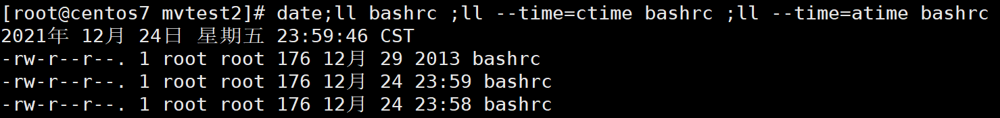
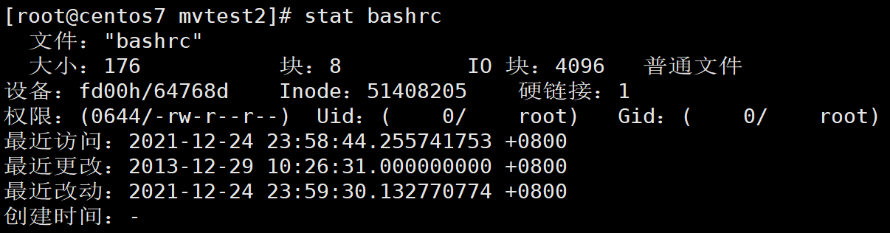
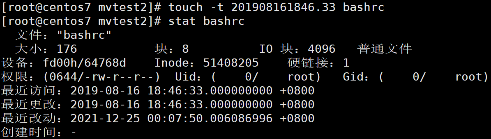

[toc]

# locale 

```shell
# 查看语系
locale
# 查询支持的语系
locale -a

```

```shell
# 修改语系
LANG=en_US.utf8
# 设置所有语言环境 英文
export LC_ALL=en_US.utf8
# 设置所有语言环境 中文
export LC_ALL=zh_CN.utf8
```
> 系统永久生效可以修改`/etc/locale.conf`文件

# date 日期

```shell
date
# 年-月-日
date +%Y-%m-%d
date +%F
# 时:分:秒
date +%H:%M:%S
date +%T
# 年-月-日 时:分:秒
date "+%Y-%m-%d %H:%M:%S"
date +'%F %T'
```

# cal 日历

```
cal [month] [year]
cal 
cal 2020
cal 3 2020
```

# bc 计算器

```
bc
1+2+3
3-2
2*3
3/2
5%2
2^3
quit
#设置小数点
scale=3
```

`tab` 键提示

`Ctrl+C` 停止当前运行的程序 

`Ctrl+D` 键盘输入结束,不会用

`Shift+↑/↓` 上下行翻动屏幕

`Shift+PagUp/PagDn` 上下页翻动屏幕

--help求助说明

```
date --help
```

# man page

```
man date
```

`空格` 向下翻页

`q` 离开

`/` 向下搜索关键词

`?` 向上搜索关键词

`n` :继续下一个搜索 ,`N` :继续上一个搜索

`Home` 第一页

`End` 最后一页

man page所在路径

```
/usr/share/man/
```

查看`man`指令有关的说明文件

```
#man -f man
#whatis man
man (1)              - an interface to the on-line reference manuals
man (1p)             - display system documentation
man (7)              - macros to format man pages
```

查看指定的说明文件

```
man 1 man
man 7 man
```

默认打开的说明文件顺序

```
/etc/man_db.conf
```

关键词查找

```shell
#查找含有man关键词的说明文件
man -k man

apropos man
```

`man -f man` = `whatis man`

`man -k man` = `apropos man`

使用上述两个命令的时候必须要建立whatis数据库

```shell
mandb
```


# info page

info指令的文件存放位置

```shell
/usr/share/info/
```

info gcc

`h` 帮助快捷键

`x` 退出帮助

`q` 退出info

`n` 下一个结点

`p` 前一个结点

`t` 头结点

 

# 正确关机

- 观察系统使用状态

`who` 谁在线

`netstat -a` 网络状态

`ps -aux` 查看背景执行的程序

- 通知在线使用者关机的时刻

- 关机

`sync` 将数据同步写入硬盘中的指令

`shutdown` 惯用的关机

`reboot` `halt` `poweroff` 重启,关机


切换身份

```
#su -

#logout 或 exit
```


# shutdown

```
#shutdown [-krhc] [时间] [警告讯息]

-k 只是警告
-r 重启
-h 关机
-c 取消关机

#shutdown -h 10 '10分钟后关机'
#shutdown -h now
#shutdown -h 20:18
#shutdown -r now

重启
#sync;sync;sync;reboot
关机
#halt
#poweroff

#systemctl reboot
#systemctl poweroff
```

# 查看文件时间
```shell
#查看文件的时间
#mtime 默认文件内容修改时间 ll bashrc
#ctime 文件属性修改时间
#atime 文件最近访问时间
date;ll bashrc ;ll --time=ctime bashrc ;ll --time=atime bashrc 
```


```shell
#stat 文件名 查看文件时间戳
stat bashrc
```


# touch 

```shell
touch -t 201908161846.33 bashrc
stat bashrc
```


# yum

`yum` 是用于在基于 RPM（Red Hat Package Manager）的 Linux 发行版上管理软件包的包管理器。以下是一些常用的 yum 命令：

安装软件包
```bash
yum install package_name
```

更新软件包
> 用于更新系统上已安装的所有软件包，包括操作系统的核心组件和其他已安装的软件包。
```bash
yum update
```

升级特定软件包
```bash
yum update package_name
```

查找软件包信息
```bash
yum info package_name
```

列出所有已安装的软件包
```bash
yum list installed
```

搜索可用软件包
```bash
yum search keyword
```

删除软件包
```bash
yum remove package_name
```

清理缓存
```bash
yum clean all
```

显示软件包组信息
```bash
yum grouplist
```

安装软件包组
```bash
yum groupinstall group_name
```

删除软件包组
```bash
yum groupremove group_name
```

检查可用更新
```bash
yum check-update
```

查看软件包提供哪些文件
```bash
yum provides file_path
```