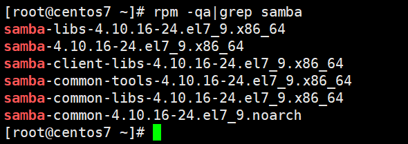
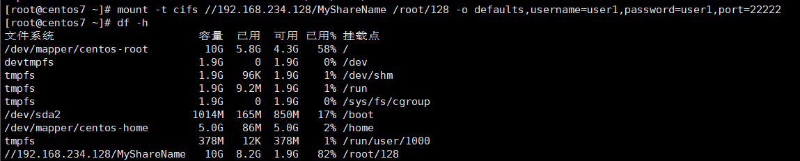

# samba服务搭建及管理

> 演示环境CentOS 7

> Samba是一种开放源代码软件，可以在Linux、UNIX和类Unix操作系统之间共享文件、打印机和其他共享资源。它允许Linux和UNIX服务器成为Windows客户端的文件和打印机服务器，以及Microsoft Windows服务器成为Linux和UNIX客户端的文件和打印机服务器。

## 1. 安装samba

### 查看安装情况
```shell
rpm -qa|grep samba
```


### 如果没有安装需要手动安装
```shell
sudo yum install samba -y
```

### 查看samba版本
```shell
# 方法一
smbd --version
# 方法二
rpm -qi samba
```


## 创建共享目录

打开终端并以 root 用户身份登录。
创建一个新的目录并设置权限：
```shell
mkdir /srv/share && chmod 777 /srv/share
```

## 创建使用samba的用户

```shell
useradd -M  -s /sbin/nologin user1
```
`-s`表示指定用户所用的shell，此处为`/sbin/nologin`，表示用户不允许登录系统。

`-M`表示不创建用户主目录。

## 将系统用户添加到samba用户中，并添加密码

```shell
smbpasswd -a user1
```
常见选项如下
```
options:
  -a                   add user
  -d                   disable user
  -e                   enable user
  -n                   set no password
  -x                   delete user
```

## 配置smb.conf文件
将共享目录添加到 Samba 的配置文件中，以便其他计算机可以访问它。可以编辑 /etc/samba/smb.conf 文件，并在文件底部添加以下内容：
```shell
[global]
    workgroup = WORKGROUP
    server string = Samba Server Version %v
    security = user
    netbios name = MYSERVER
    smb ports = 445 22222

[MyShareName]
    comment = Shared directory
    path = /srv/share
    valid users = user1
    browsable = yes
    guest ok = yes
    read only = no
    create mask = 0777
    directory mask = 0777
```

`security = user`表示使用基于用户的安全模型进行身份验证，这样就可以为不同的用户设置不同的访问权限。

`[MyShareName]`：这是您的共享名称，也是Windows中显示的名称。

`comment`：这是关于共享内容的描述。

`path`：这是需要共享的目录的完整路径。

`valid users`：表示允许访问该共享目录的用户，可以使用空格分隔多个用户。

`browseable`：设置为 yes 后，可以在资源管理器中浏览共享。

`guest ok`：设置为 yes 后，任何用户都可以访问共享。

`read only`：设置为 yes 后，用户只能读取文件，不能写入或删除文件。

`create mask`：此选项指定新文件的默认权限。在此示例中，创建的新文件将具有所有者和组读写执行权限，其他人将具有读执行权限。

`directory mask`：此选项指定新目录的默认权限。在此示例中，创建的新目录将具有所有者和组读写执行权限，其他人将具有读执行权限。


## 启动、停止、重启服务、查看状态

### CentOS7
查看samba服务状态
```shell
systemctl status smb.service
```
> 如果服务正在运行，您将看到“Active: active (running)”的状态。

```shell
# 启动samba服务
systemctl start smb.service
# 停止samba服务
systemctl stop smb.service
# 重启samba服务
systemctl restart smb.service
```

### Redhat

查看samba服务状态
```shell
service smb status
```
> 如果服务正在运行，您将看到“smbd (pid 27997) is running...”的状态。

```shell
# 启动samba服务
service smb start
# 停止samba服务
service stop smb
# 重启samba服务
service smb restart
```

## 脚本查看状态、端口
```shell
service smb status
service nmb status
echo
lsof -iTCP -sTCP:LISTEN -n -P | grep smbd
```
> 新建samba_status.sh文件，将上述命令复制导文件内，报错后退出。赋予文件可执行权限`chmod 755 samba_status.sh`，后续可以直接通过该脚本查看samba服务的状态。


# linux挂载、卸载

挂载
```shell
mount -t cifs //192.168.234.128/MyShareName /root/128 -o defaults,username=user1,password=user1,port=22222
```


卸载
```shell
umount -f /root/128
```

# windows添加网络映射

```shell
# 添加端口转发
netsh interface portproxy add v4tov4 listenport=445 listenaddress=127.0.0.1 connectport=22222 connectaddress=192.168.234.128
# 查看全部端口转发
netsh interface portproxy show all
# 删除端口转发
netsh interface portproxy delete v4tov4 listenaddress=127.0.0.1 listenport=445
```
1. 打开“计算机”或“文件资源管理器”，点击菜单栏上的“工具” → “映射网络驱动器”。 
2. 在弹出的“添加网络位置”对话框中，输入要映射的网络共享路径，例如：\192.168.234.128\MyShareName。 
3. 勾选“使用其他凭证连接”，并点击“完成”按钮。 
4. 在弹出的“输入网络凭据”对话框中，输入用户名和密码，并勾选“记住我的凭据”选项。 
5. 点击“确定”按钮完成网络映射。
> 如果你需要设置自定义的端口，则需要在共享路径后面添加冒号和端口号，例如：\192.168.234.128:2222\MyShareName。需要注意的是，此时要确保 Samba 服务器端口已经设置为 2222，且防火墙已经打开了对应的端口。