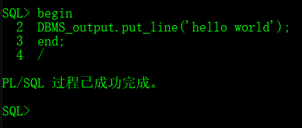
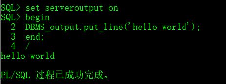
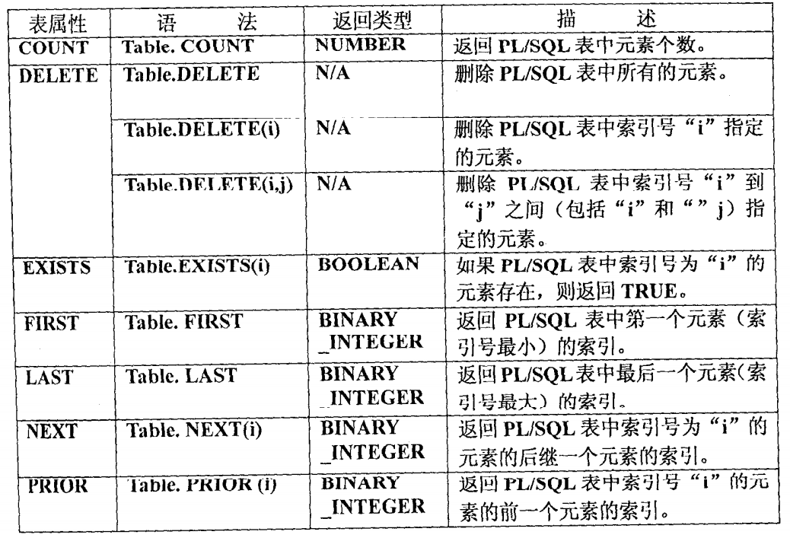
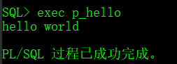
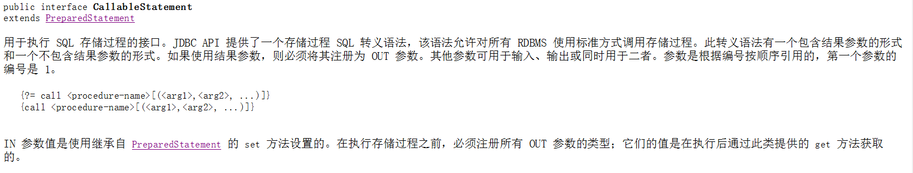
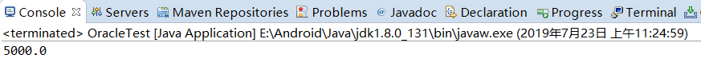

# 1 PLSQL编程

## 1.1 概念和目的

## 1.2 程序结构

**PL/SQL可用的SQL语句**

PL/SQL是ORACLE系统的核心语言，现在ORACLE的许多部件都是由PL/SQL写成。PL/SQL中可以使用的SQL语句有：

​	INSERT、UPDATE、DELETE、SELECT...INTO、COMMIT、ROLLBACK、SAEPOINT

**PL/SQL语言的大小写是不区分的**

PL/SQL可以分为三个部分：**声明部分**、**可执行部分**、**异常处理部分**

```plsql
DECLARE
	--声明变量、游标
	I INTEGER;
BEGIN
	--执行语句
	--[异常处理]
END;
```

其中DECLARE部分用来声明变量或游标（结果集类型变量），如果程序中无变量声明可以忽略掉

## 1.3 打印helloworld

```plsql
begin
	DBMS_output.put_line('hello world');
end;
```



如果是在命令行中，发现没有打印结果，我们需要将输出设置打开

```sql
set serveroutput on
```



## 1.4 变量

PLSQL编程中常见的变量分两大类：

- 普通数据类型（char,varchar2,date,number,boolean,long）
- 特殊数据类型(引用型变量、记录型变量)

声明变量的方式：

> 变量名 变量类型（变量长度）
>
> 如：v_name varchar2(20)

### 1.4.1 普通类型

> 打印员工信息

```plsql
--打印人员个人信息，包括：姓名、薪水、地址
DECLARE
    --姓名
    v_name VARCHAR2(20) := '朱俊伟';
    --薪水
    v_sal NUMBER;
    --地址
    v_addr VARCHAR2(20);
BEGIN
    --直接赋值
    v_sal := 9999;
    --语句赋值
    SELECT '上海嘉定区' INTO v_addr FROM dual;
    --打印输出
	dbms_output.put_line('姓名：'|| v_name || ',薪水：' || v_sal || ',地址：'|| v_addr);
END;
```

输出：

> 姓名：朱俊伟,薪水：9999,地址：上海嘉定区

### 1.4.2 引用型变量

变量的类型和长度取决于表中字段的类型和长度

通过==**表名.列名%TYPE**==指定变量的类型和长度，例如：v_name emp.ename%TYPE;

> 查询emp表中7839号员工的个人信息，打印姓名和薪水

```plsql
--查询emp表中7839号员工的个人信息，打印姓名和薪水
DECLARE
    --引用型变量
    --姓名
    v_name emp.ename%TYPE;
    --薪水
    v_sal emp.sal%TYPE;
BEGIN
    --语句赋值
    SELECT ename,sal INTO v_name,v_sal FROM emp WHERE empno=7839;
    --打印输出
	dbms_output.put_line('姓名：'|| v_name || ',薪水：' || v_sal );
END;
```

### 1.4.3 记录型变量

接收表中的一整行记录，相当于java中的一个对象

语法：

> 变量名称 **表名%ROWTYPE**
>
> 如：
>
> v_emp emp%rowtype

> 查询并打印7839号员工的姓名和薪水

```plsql
--查询emp表中7839号员工的个人信息，打印姓名和薪水
DECLARE
    --记录型变量
    v_emp emp%rowtype;
BEGIN
    --语句赋值
    SELECT * INTO v_emp FROM emp WHERE empno=7839;
    --打印输出
	dbms_output.put_line('姓名：'|| v_emp.ename || ',薪水：' || v_emp.sal );
END;
```

> 定义记录型

```plsql
declare 
	--定义一个记录类型，存放雇员编号，姓名，雇佣日期
    TYPE t_emp IS RECORD(
        num emp.empno%TYPE,
        name emp.ename%TYPE,
        hiredate emp.hiredate%TYPE
    );
    --声明一个记录类型变量来接收数据
    v_emp t_emp;
BEGIN
   SELECT empno,ename,hiredate INTO v_emp
   FROM emp WHERE ename='SMITH';
   DBMS_OUTPUT.put_line(v_emp.num ||','||v_emp.name||','||v_emp.hiredate);
END;

```

**表**

定义一个表类型的语法如下：

> TYPE tabletype IS TABLE OF type INDEX BY BINARY_INTEGER

**使用表类型**

```plsql
declare 
    --定义一个记录表
    TYPE t_emp IS TABLE OF emp%ROWTYPE
        INDEX BY BINARY_INTEGER;
    --声明记录表
    v_emp t_emp;
BEGIN
   SELECT * INTO v_emp(00001)
   FROM emp WHERE ename='SMITH';
   DBMS_OUTPUT.put_line(v_emp(00001).empno ||','||v_emp(00001).ename||','||v_emp(00001).hiredate);
END;
```

表属性



> 使用DELETE属性和COUNT属性

```plsql
declare 
    --定义一个记录表
    TYPE t_CharRecord IS TABLE OF VARCHAR2(20)
        INDEX BY BINARY_INTEGER;
    --声明变量
    v_Chars t_CharRecord;
    v_Counter NUMBER;
BEGIN
   --向表中插入元素
   v_chars(-6):='negative';
   v_chars(0):='zero';
   v_chars(4):='sdf';
   v_chars(90):= 'ninety';
   
   --删除前，PL/SQL表中元素的个数
   v_counter:=v_chars.COUNT;
   DBMS_OUTPUT.put_line(v_counter);
   --删除索引号为90的元素，并得到删除后的元素个数
   v_chars.DELETE(90);
   v_counter:=v_chars.COUNT;
   DBMS_OUTPUT.put_line(v_counter);
   --删除索引号从0-4的元素
   v_chars.DELETE(0,4);
   v_counter:=v_chars.COUNT;
   DBMS_OUTPUT.put_line(v_counter);
   --删除PL/SQL表中的所有元素
   v_chars.DELETE;
   v_counter:=v_chars.COUNT;
   DBMS_OUTPUT.put_line(v_counter);
END;
```

删除表的全部数据时，除了可以使用DELETE外，还可以将空表赋值给它

> 使用FIRST、NEXT、LAST

```plsql
declare 
    --定义一个记录表
    TYPE t_Code IS TABLE OF VARCHAR2(20)
        INDEX BY BINARY_INTEGER;
    --声明变量
    v_code t_code;
    v_index BINARY_INTEGER;
BEGIN
   --向表中插入元素
   v_code(1001):='A001';
   v_code(1006):='A006';
   v_code(1009):='A009';
   
   --得到第一个元素的索引号
   v_index:=v_code.FIRST;
   DBMS_OUTPUT.put_line(v_index);
   --得到索引号为'1001'的元素后的元素索引号
   v_index:=v_code.NEXT(1001);
   DBMS_OUTPUT.put_line(v_index);
   --得到最后一个元素的索引号
   v_index:=v_code.LAST;
   DBMS_OUTPUT.put_line(v_index);
END;
```

## 1.5 流程控制

### 1.5.1 条件分支

语法：

> BEGIN
>
> ​	IF 条件1 THEN 执行1
>
> ​		ELSIF 条件2 THEN 执行2
>
> ​		ELSE 执行3
>
> ​	END IF;
>
> END;

> 判断emp表中记录是否超过20条，10~20之间，或者10条以下

```plsql
--判断emp表中记录是否超过20条，10~20之间，或者10条以下
DECLARE
    --声明变量接收emp中的数量
    v_count NUMBER;
BEGIN
    --语句赋值
    SELECT count(1) INTO v_count FROM emp;
    --条件分支
    IF v_count>20 THEN
        DBMS_OUTPUT.PUT_LINE('表中记录大于20条，数量为：' || v_count);
    ELSIF v_count>=10 THEN
        DBMS_OUTPUT.PUT_LINE('表中记录在10~20条之间，数量为：' || v_count);
    ELSE
        DBMS_OUTPUT.PUT_LINE('表中记录小于10条，数量为：' || v_count);
    END IF;
END;
```

结果：

> 表中记录在10~20条之间，数量为：15

### 1.5.2 循环

在ORACLE中有三种循环方式，这里只介绍一种：loop

语法：

> BEGIN
>
> ​	LOOP
>
> ​		EXIT WHEN 退出循环条件；
>
> ​				语句；
>
> ​	END LOOP;
>
> END;

> 打印数字1-10

```plsql
--打印数字1-10
DECLARE
    --声明循环变量并赋初值
    v_num NUMBER := 1;
BEGIN
   LOOP
   	EXIT WHEN v_num>10;
   	DBMS_OUTPUT.put_line(v_num);
  	--循环变量自增
   	v_num := v_num+1;
   END LOOP;
END;
```

>BEGIN
>
>​	LOOP
>
>​		WHILE 循环执行条件  LOOP
>
>​			语句；
>
>​	END LOOP;
>
>END;

```plsql
--打印数字1-10
DECLARE
    --声明循环变量并赋初值
    v_num NUMBER := 1;
BEGIN
   LOOP
   	WHILE v_num<=10 LOOP
   	DBMS_OUTPUT.put_line(v_num);
  	--循环变量自增
   	v_num := v_num+1;
   END LOOP;
END;
```

FOR...LOOP

>BEGIN
>  FOR 循环变量 IN 初始值..结束值 LOOP
>   	语句；
>   END LOOP;

```plsql
--打印数字1-10
DECLARE
    --声明循环变量
    v_num NUMBER;
BEGIN
   FOR v_num IN 1..10 LOOP
   	DBMS_OUTPUT.put_line(v_num);
   END LOOP;
END;
```

# 2 游标

## 2.1 什么是游标

用于临时存储一个查询返回的多行数据（结果集，类似于Java的jdbc连接返回的ResultSet集合），通过遍历游标，可以逐行访问处理该结果集的数据。

游标的使用方法：声明-->打开-->读取-->关闭

## 2.2 语法

>游标声明：
>
>CURSOR 游标名[(参数列表)] IS 查询语法；
>
>游标的打开：
>
>OPEN 游标名；
>
>游标的取值：
>
>FETCH 游标名 INTO 变量列表；
>
>游标的关闭：
>
>CLOSE 游标名；

## 2.3 游标的属性

| 游标的属性 | 返回值类型 | 说明                                         |
| ---------- | ---------- | -------------------------------------------- |
| %ROWCOUNT  | 整型       | 获取FETCH语法返回的数据行数                  |
| %FOUND     | 布尔型     | 最近的FETCH语句返回一行数据,则为真，否则为假 |
| %NOTFOUND  | 布尔型     | 与%FOUND属性返回值相反                       |
| %ISOPEN    | 布尔型     | 游标已经打开时为真，否则为假                 |

其中%NOTFOUND是在游标中找不到元素的时候返回TRUE，通常用来判断退出循环

## 2.4 创建和使用

> 使用游标查询emp表中所有员工的姓名和工资，并将其依次打印出来

```plsql
--使用游标查询emp表中所有员工的姓名和工资，并将其依次打印出来
DECLARE
    --声明游标
    CURSOR c_emp IS SELECT ename,sal FROM emp;
    --声明变量接收游标中的数据
    v_ename emp.ename%TYPE;
    v_sal emp.sal%TYPE;
BEGIN
    --打开游标
    OPEN c_emp;
    LOOP
    	--取出游标中的值
    	FETCH c_emp INTO v_ename,v_sal ;
        EXIT WHEN c_emp%NOTFOUND;
        DBMS_OUTPUT.put_line(v_ename|| '-' || v_sal);
    END LOOP;
    CLOSE c_emp;
END;
```

## 2.5 带参数的游标

> 使用游标查询并打印某部门的员工的姓名和薪资，部门编号为运行时手动输入

```plsql
--使用游标查询并打印某部门的员工的姓名和薪资，部门编号为运行时手动输入
DECLARE
    --声明游标
    CURSOR c_emp(v_deptno emp.deptno%TYPE) IS SELECT ename,sal FROM emp WHERE deptno=v_deptno;
    --声明变量接收游标中的数据
    v_ename emp.ename%TYPE;
    v_sal emp.sal%TYPE;
BEGIN
    --打开游标
    --输入参数
    OPEN c_emp(10);
    LOOP
    --取出游标中的值
    FETCH c_emp INTO v_ename,v_sal ;
    EXIT WHEN c_emp%NOTFOUND;
    DBMS_OUTPUT.put_line(v_ename|| '-' || v_sal);
    END LOOP;
    CLOSE c_emp;
END;
```

## 2.6 隐式游标的使用

```plsql
--使用隐式游标
DECLARE
    --声明变量接收一行记录
    v_emp emp%ROWTYPE;
BEGIN
    --返回一条记录
    --SELECT * INTO v_emp FROM emp WHERE empno='7369';
    --返回多条记录
    --SELECT * INTO v_emp FROM emp WHERE deptno='10';
    --没有记录
    SELECT * INTO v_emp FROM emp WHERE deptno='100';
    
    /*
      对返回的结果进行判断     
    */
    /*正常执行*/
    --一条记录
    IF SQL%FOUND THEN
      DBMS_OUTPUT.put_line(v_emp.ename|| '-' || v_emp.deptno);
    END IF;
    /*执行异常*/
    EXCEPTION
      --没有记录
      WHEN NO_DATA_FOUND THEN
        DBMS_OUTPUT.put_line('该记录不存在');
      --多条记录
      WHEN TOO_MANY_ROWS THEN
        DBMS_OUTPUT.put_line('记录有多条');
END;
```


# 3 存储过程

## 3.1 概念作用

PLSQL是将一个个PLSQL的业务处理过程存储起来进行复用，这些被存储起来的PLSQL程序称之为存储过程。

作用：在开发程序中，为了一个特定的业务功能，会向数据库进行多次连接关闭（连接和关闭是很耗费资源），需要对数据库进行多次I/O读写，性能比较低。如果把这些业务放到PLSQL中，在应用程序中只需要调用PLSQL就可以做到连接关闭一次数据库就可以实现我们的业务，可以大大提高效率。

## 3.2 语法

> CREATE OR REPLACE PROCEDURE 过程名称[（参数列表）] IS/AS
>
> BEGIN
>
> 
>
> END [过程名称];

## 3.3 无参存储

### 3.3.1 创建存储

```plsql
create or replace PROCEDURE P_HELLO AS 
--声明变量
BEGIN
  DBMS_OUTPUT.PUT_LINE('hello world');
END P_HELLO;
```

### 3.3.2 调用存储过程

```plsql
BEGIN
   p_hello;
END;
```

在SQLPLUS中通过EXEC命令调用：



注意：

- is和as是可以互用的，用哪个都没有关系
- 过程中没有declare关键字，declare用在语句块中

## 3.4 带输入参数的存储过程

**参数的数据类型**

在定义一个存储过程时，不能指定CHAR类型和VARCHAR2类型形参的长度，也不能指定NUMBER形参的精度和标度，这些约束由实参来传递。

创建存储过程

```plsql
--带参数的存储过程
create or replace PROCEDURE p_querynameandsal(i_empno IN emp.empno%type) AS 
--声明变量
v_name emp.ename%TYPE;
v_sal emp.sal%TYPE;
BEGIN
    --查询emp表中某个员工的姓名和薪水并赋值给变量
    SELECT ename,sal INTO v_name,v_sal FROM emp WHERE empno=i_empno;
    DBMS_OUTPUT.PUT_LINE(v_name || '_' || v_sal);
END ;
```

调用

```plsql
BEGIN
   p_querynameandsal(7839);
END;
```

```plsql
DECLARE
  v_empno NUMBER;
BEGIN
  v_empno:=7369;
  --形参=>实参
  p_querynameandsal(i_empno =>v_empno );
END;
```

## 3.5 带输出参数的存储过程

### 创建存储过程

> 输入员工号查询某个员工（7839）的信息，要求将薪水作为返回值输出，给调用的程序使用。

P_QUERYSAL_OUT

```plsql
create or replace PROCEDURE p_querysal_out(i_empno IN emp.empno%type,o_sal OUT emp.sal%TYPE) AS 
BEGIN
    --查询emp表中某个员工的薪水并赋值给变量
    SELECT sal INTO o_sal FROM emp WHERE empno=i_empno;
END ;
```

### 调用存储过程

```plsql
declare 
v_sal emp.sal%TYPE;
BEGIN
   p_querysal_out(7839,v_sal);
   DBMS_OUTPUT.put_line(v_sal);
END;
```

# 函数

## 创建函数

```plsql
--查询某一部门的人数，传入部门的编号
create or replace function F_QUERYDEPTSUM_OUT(p_deptno in emp.deptno%type) return number is
  FunctionResult number;
begin
  select count(*) into FunctionResult
  from emp
  where deptno=p_deptno;
  return(FunctionResult);
end F_QUERYDEPTSUM_OUT;
```

## 调用函数

```plsql
DECLARE
  --接收函数返回的值
  v_deptsum number;
BEGIN
    v_deptsum := f_querydeptsum_out(10);
    dbms_output.put_line(v_deptsum);
END;
```

# 包

## 创建包头

```plsql
create or replace package pac_z_test is

  -- Author  : JUNWEI.ZHU
  -- Created : 2019/7/31 8:46:35
  -- Purpose : 朱俊伟测试使用
  
  --查询某一部门的人数，传入部门的编号
  function FZ_QUERYDEPTSUM_OUT(p_deptno in emp.deptno%type) return number;
  --传入某员工的编号，打印其名字和工资
  PROCEDURE p_querynameandsal(i_empno IN emp.empno%type);
  --传入某个员工的编号，返回其工资
  PROCEDURE pz_querysal_out(i_empno IN emp.empno%type,o_sal OUT emp.sal%TYPE);
end pac_z_test;
```

## 创建包体

```plsql
create or replace package body pac_z_test is

  /*查询某一部门的人数，传入部门的编号*/
  FUNCTION FZ_QUERYDEPTSUM_OUT(p_deptno in emp.deptno%type) return number is
    FunctionResult number;
  begin
    select count(*) into FunctionResult
    from emp
    where deptno=p_deptno;
    return(FunctionResult);
  end FZ_QUERYDEPTSUM_OUT;

  
  /*传入某员工的编号，打印其名字和工资*/
  PROCEDURE p_querynameandsal(i_empno IN emp.empno%type) is
    v_name emp.ename%TYPE;
    v_sal emp.sal%TYPE;
  begin
    SELECT ename,sal INTO v_name,v_sal FROM emp WHERE empno=i_empno;
    DBMS_OUTPUT.PUT_LINE(v_name || '_' || v_sal);
  end p_querynameandsal;
  
  /*传入某个员工的编号，返回其工资*/
  PROCEDURE pz_querysal_out(i_empno IN emp.empno%type,o_sal OUT emp.sal%TYPE) AS
  BEGIN
    SELECT sal INTO o_sal FROM emp WHERE empno=i_empno;
  END pz_querysal_out;
  
end pac_z_test;
```

## 编写测试程序

```plsql
declare 
  v_sal emp.sal%TYPE;
  v_deptnum number;
begin
  
  /*查询某一部门的人数，传入部门的编号*/
  v_deptnum := pac_z_test.FZ_QUERYDEPTSUM_OUT(10);
  Dbms_Output.put_line(v_deptnum);
  /*传入某员工的编号，打印其名字和工资*/
  pac_z_test.p_querynameandsal(7369);
  /*传入某个员工的编号，返回其工资*/
  pac_z_test.pz_querysal_out(7369,v_sal);
  Dbms_Output.put_line(v_sal);
end;
```

## 3.6 java程序调用存储过程

需求：如果一条语句无法实现结果集，比如需要多表查询，或者需要复杂逻辑查询，我们可以选择调用存储查询出你的结果

### 3.6.1 分析jdk API


通过Connection对象的prepareCall方法可以调用存储过程



通过Connection对象调用prepareCall方法传递一个转义sql语句调用存储过程，输入参数直接调用set方法传递.输出参数需要注册后，执行存储过程，通过get方法获取。参数列表的下标是从1开始的。

### 3.6.2 代码实现

准备环境：

> 导入Oracle的jar包

在sqldeveloper安装目录下找到

E:\sqldeveloper\jdbc\lib\ojdbc8.jar

> 代码

```java
package com.zjw.test;

import java.sql.CallableStatement;
import java.sql.Connection;
import java.sql.DriverManager;

import oracle.jdbc.internal.OracleTypes;

public class OracleTest {
	public static void main(String[] args) throws Exception {
		
		//1、加载驱动
		Class.forName("oracle.jdbc.driver.OracleDriver");
		
		//2、获取连接对象
		String url = "jdbc:oracle:thin:@localhost:1521:orcl";
		String user = "scott";
		String password = "tiger";
		Connection conn = DriverManager.getConnection(url, user, password);
		
		//3、获取语句对象
		String sql = "{call p_querysal_out(?,?)}";
		CallableStatement call = conn.prepareCall(sql);
		
		//4、设置输出参数
		call.setInt(1, 7839);
		
		//5、注册输出参数
		call.registerOutParameter(2, OracleTypes.DOUBLE);
		
		//6、执行存储过程
		call.execute();
		
		//7、获取输出参数
		double sal = call.getDouble(2);
		System.out.println(sal);
		
		//8、释放资源
		call.close();
		conn.close();
		
		
	}
}
```

运行结果

