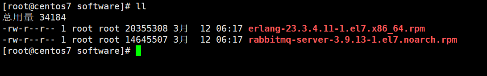

下载rabbitmq安装包

[Releases · rabbitmq/rabbitmq-server · GitHub](https://github.com/rabbitmq/rabbitmq-server/releases)

下载Erlang安装包

[Releases · rabbitmq/erlang-rpm · GitHub](https://github.com/rabbitmq/erlang-rpm/releases)


[rabbitmq和erlang对应关系](https://www.rabbitmq.com/which-erlang.html#compatibility-matrix)


上传至服务器




安装

```shell
rpm -ivh erlang-23.3.4.11-1.el7.x86_64.rpm
yum install socat logrotate -y
rpm -ivh rabbitmq-server-3.9.13-1.el7.noarch.rpm
```


安装web管理界面

```shell
rabbitmq-plugins enable rabbitmq_management
```


启动、停止MQ

```shell
service status rabbit-server
service start rabbit-server
service stop rabbit-server
```

