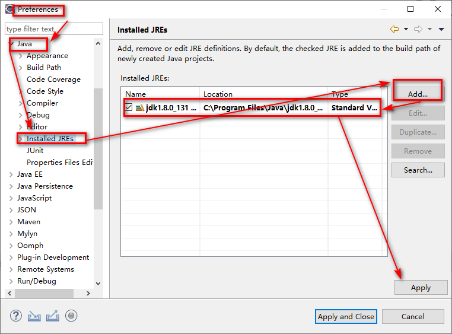
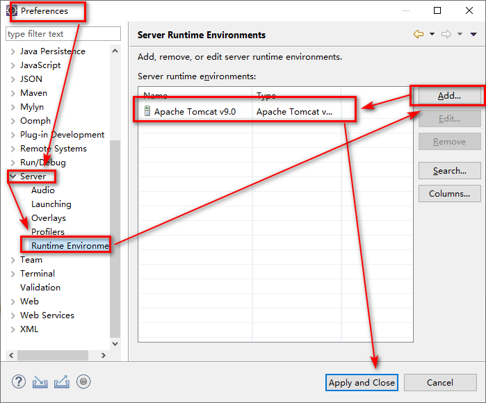
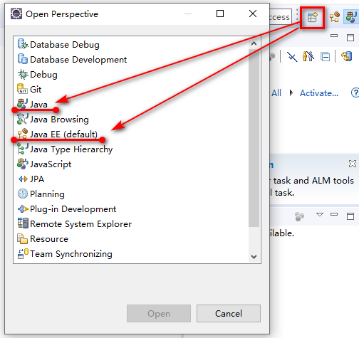
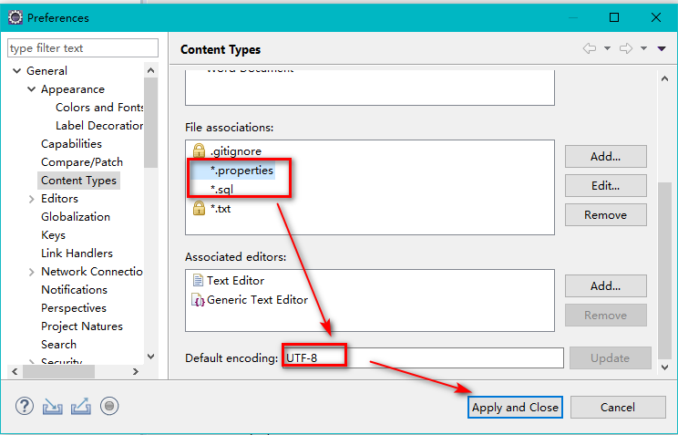
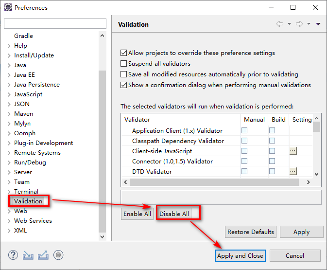

# 1、配置jdk

Window->Preferences->Java->Installed JREs

# 2、配置Tomcat

Window->Preferences->Server->Runtim Environment

# 3、配置视图

java视图

package视图、Console、Servers

# 4、配置编码格式(UTF-8)

General->**Workspace**

**Image、Java Arhive、Text**编码，每一类改完记得Update

添加 \*.properties、\*.sql的编码

Web->**JSP Files**

# 5、调整字体大小

Preferences->General->Appearance->Colors and Fonts->Basic->Text Font

# 6、去掉jsp、html、js验证

Preferences->Validation->Disable All

7、配置maven

