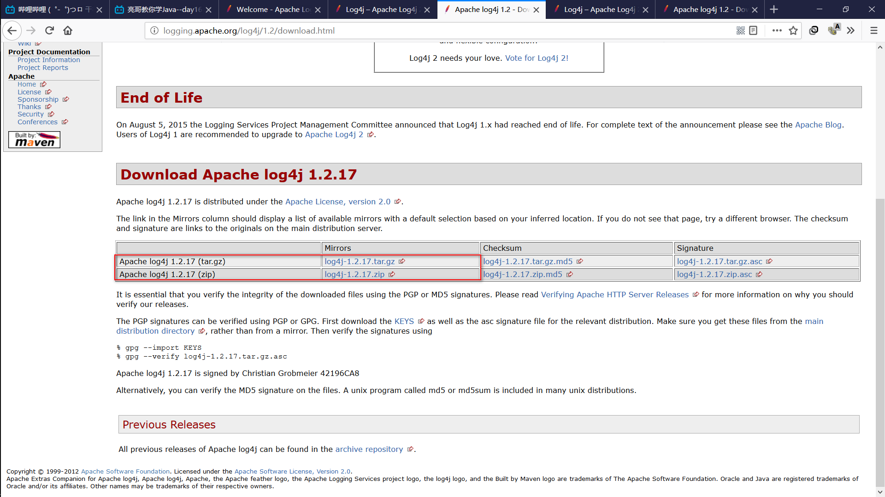
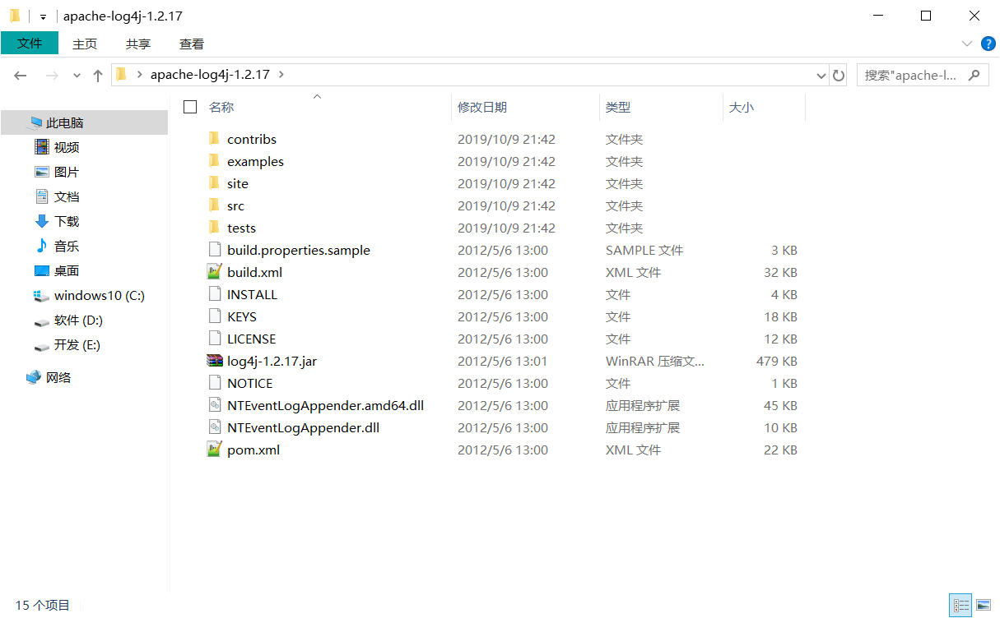
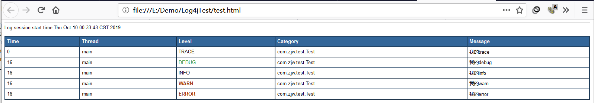

# log4j下载

百度搜索“apache”>进入[apache官网](http://www.apache.org/)>找到[项目列表](http://www.apache.org/index.html#projects-list)>找到[Logging](http://logging.apache.org/)>找到[Apache Log4j 2](http://logging.apache.org/log4j/2.x/)下载

> 学习的时候用的1.2 ，还是下载log4j2吧，了解新的功能

[log4j 1.2.17下载地址](http://logging.apache.org/log4j/extras/download.html)，可以下载二进制文件及源码。

 

解压后的目录结构



- examples : 提供的示例、配置文件的样例
- src : 源码
- log4j-1.2.17.jar : 需要使用的jar包

Log4j由单个重要的组成构成：日志记录器（Loggers），输出端（Appenders）和日志格式化器（Layout）

- Logger : 控制要启用或禁用哪些日志记录语句，并对日志信息进行级别限制
- Appenders : 指定了日志将打印到控制台还是文件中
- Layout : 控制日志信息的显示格式

# 简单示例

1、新建maven项目，创建resources文件夹，在此文件夹放入文件 log4j/examples/sort1.properties ，更名为log4j.properties

log4j.properties

```properties
log4j.rootLogger=DEBUG, A1

log4j.appender.A1=org.apache.log4j.ConsoleAppender
log4j.appender.A1.layout=org.apache.log4j.PatternLayout
log4j.appender.A1.layout.ConversionPattern=%-4r %-5p [%t] %37c %3x - %m%n
```

3、添加log4j依赖

```xml
<dependency>
    <groupId>log4j</groupId>
    <artifactId>log4j</artifactId>
    <version>1.2.17</version>
</dependency>
```

4、创建测试类

```java
package com.zjw.test;

import org.apache.log4j.Logger;

public class Test {

	public static Logger logger = Logger.getLogger(Test.class);
	
	public static void main(String[] args) {
		logger.trace("我的trace");
		logger.debug("我的debug");
		logger.info("我的info");
		logger.warn("我的warn");
		logger.error("我的error");
	}
}
```

5、运行测试类，查看控制台输出结果

```
0    DEBUG [main]                     com.zjw.test.Test     - 我的debug
0    INFO  [main]                     com.zjw.test.Test     - 我的info
0    WARN  [main]                     com.zjw.test.Test     - 我的warn
0    ERROR [main]                     com.zjw.test.Test     - 我的error
```

6、修改log4j.rootLogger为ERROR，再次运行，观察控制台

```
0    ERROR [main]                     com.zjw.test.Test     - 我的error
```

**log4j的日志级别**

**TRACE<DEBUG<INFO<WARN<ERROR**

```
A : off 最高等级，用于关闭所有日志记录
B : fatal 指出每个严重的错误事件将会导致应用内程序的退出
C : error 指出虽然发生错误事件，但仍然不影响系统的继续运行
D : warn 表明会出现潜在的错误情形
E : info 一般和在粗粒度级别上，强调应用程序的运行全程
F : debug 一般用于细粒度级别上个，对调式应用程序非常有帮助
G : all(trace) 最低等级，用于打开所有日志记录
```

> 可以在开发的时候使用DEBUG，在项目发布的时候使用INFO

Log4j几种常用的输出目的地

```properties
#将日志输出到控制台
org.apache.log4j.ConsoleAppender
#将日志输出到一个文件
org.apache.log4j.FileAppender
#将日志输出到一个文件，每天输出一个
org.apache.log4j.DailyRollingFileAppender
#将日志输出到一个文件，指定但文件达到一定大小后产生新的文件
org.apache.log4j.RollingFileAppender
#将日志以流格式发送到任意指定地方
org.apache.log4j.WriteAppender
```

三种Layout格式

1、SimpleLayout

```properties
#输出到控制台,简单样式
log4j.appender.A4=org.apache.log4j.ConsoleAppender
log4j.appender.A4.layout=org.apache.log4j.SimpleLayout
```

​	输出样式

```
TRACE - 我的trace
DEBUG - 我的debug
INFO - 我的info
WARN - 我的warn
ERROR - 我的error
```

2、PatternLayout（见简单示例）

3、HTMLLayout

```properties
#输出到文件,html样式
log4j.appender.A5=org.apache.log4j.RollingFileAppender
log4j.appender.A5.File=test.html
log4j.appender.A5.layout=org.apache.log4j.HTMLLayout
```

​	输出样式



# PatternLayout的输出参数含义

参考https://blog.csdn.net/tiansheng1225/article/details/83012916


# 完整log4j.properties

```properties
#TRACE,DEBUG,INFO,WARN,ERROR
log4j.rootLogger=TRACE, A5


#输出到控制台
log4j.appender.A1=org.apache.log4j.ConsoleAppender
log4j.appender.A1.layout=org.apache.log4j.PatternLayout
log4j.appender.A1.layout.ConversionPattern=%-4r %-5p [%t] %37c %3x - %m%n

#*************
#指定文件大小 *
#*************
log4j.appender.A2=org.apache.log4j.RollingFileAppender
#文件名字
log4j.appender.A2.File=test.log
#编码格式,默认是系统的编码
log4j.appender.A2.Encoding=UTF-8
#每个文件大小,默认10M
log4j.appender.A2.MaxFileSize=256KB
#是否追加,默认为true
log4j.appender.A2.Append=true
#最大文件个数，超过后会从第一个文件覆盖
log4j.appender.A2.MaxBackupIndex=20
log4j.appender.A2.layout=org.apache.log4j.PatternLayout
log4j.appender.A2.layout.ConversionPattern=%-4r %-5p [%t] %37c %3x - %m%n


#*****************
#每天产生一个文件 *
#*****************
log4j.appender.A3=org.apache.log4j.DailyRollingFileAppender
log4j.appender.A3.File=test.log
log4j.appender.A3.layout=org.apache.log4j.PatternLayout
log4j.appender.A3.layout.ConversionPattern=%-4r %-5p [%t] %37c %3x - %m%n

#输出到控制台,简单样式
log4j.appender.A4=org.apache.log4j.ConsoleAppender
log4j.appender.A4.layout=org.apache.log4j.SimpleLayout

#输出到文件,html样式
log4j.appender.A5=org.apache.log4j.RollingFileAppender
log4j.appender.A5.File=test.html
log4j.appender.A5.layout=org.apache.log4j.HTMLLayout

```

