[TOC]

# 本地仓库、中央仓库、远程仓库的区别

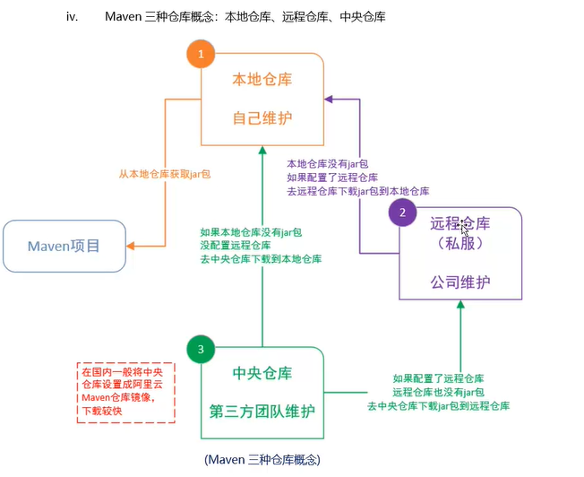

# maven维护

https://mvnrepository.com/

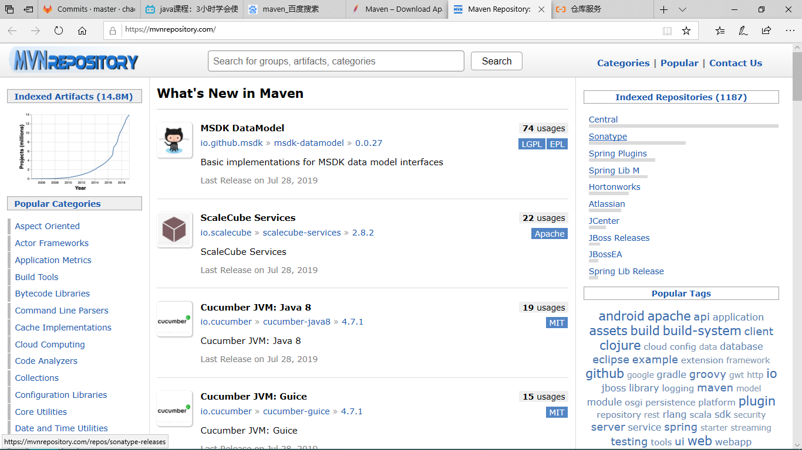

# 阿里云维护

https://maven.aliyun.com/mvn/view


# maven常用命令


# maven的生命周期和执行顺序


# 创建maven项目

## 方式一：默认的

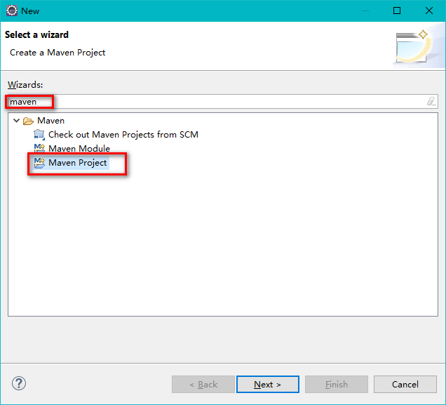


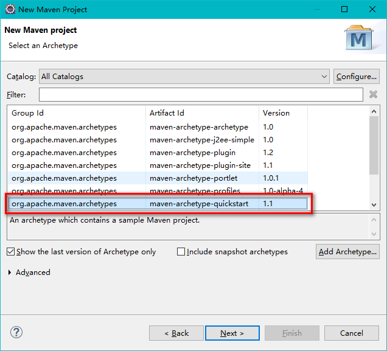

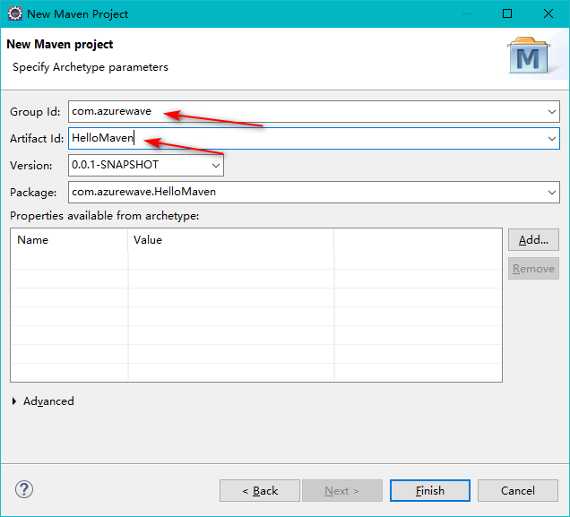

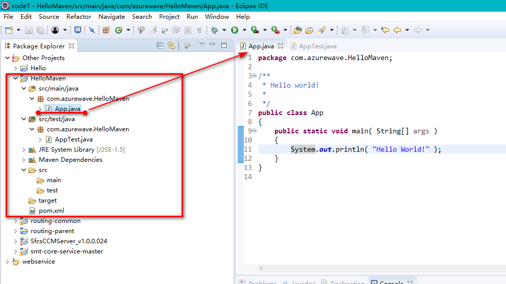

## 方式二：使用模板


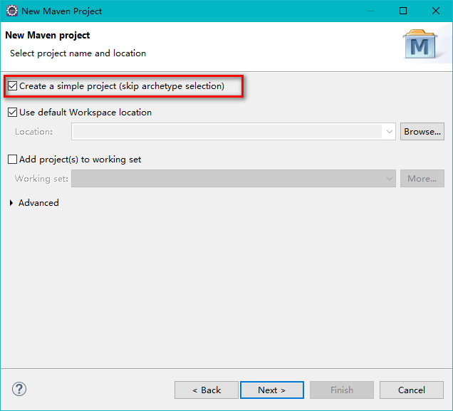

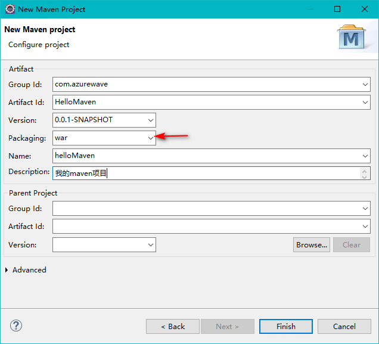

发现报错了，缺少web.xml

创建webl.xml文件

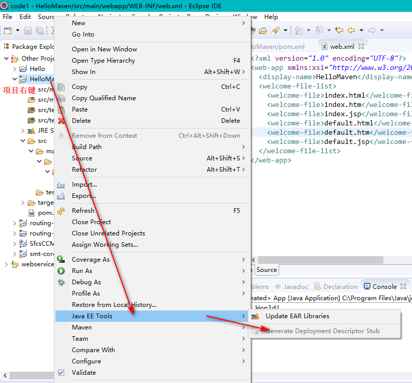

添加插件

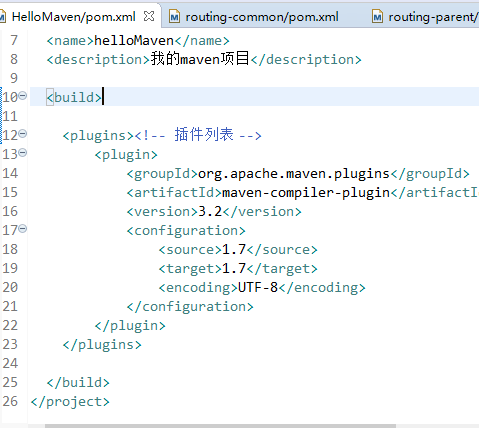

```xml
<build>
  	
  	<plugins><!-- 插件列表 -->
        <plugin>
            <groupId>org.apache.maven.plugins</groupId>
            <artifactId>maven-compiler-plugin</artifactId>
            <version>3.2</version>
            <configuration>
                <source>1.7</source>
                <target>1.7</target>
                <encoding>UTF-8</encoding>
            </configuration>
        </plugin>
  	</plugins>
 
</build>
```

发现报错，需要更新下项目

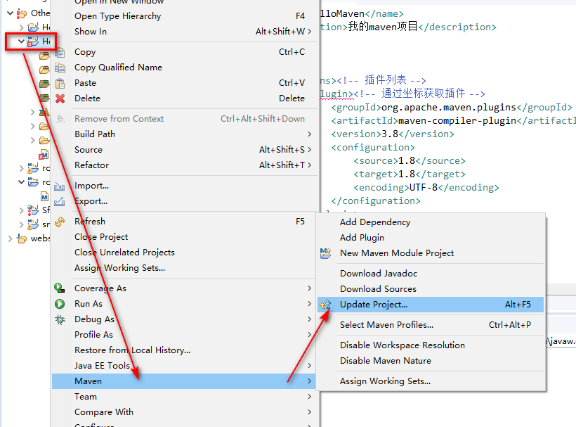

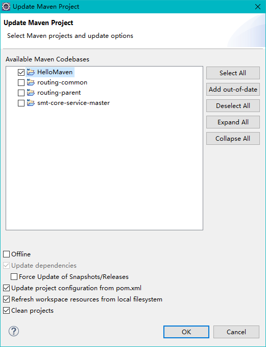

新建一个servlet

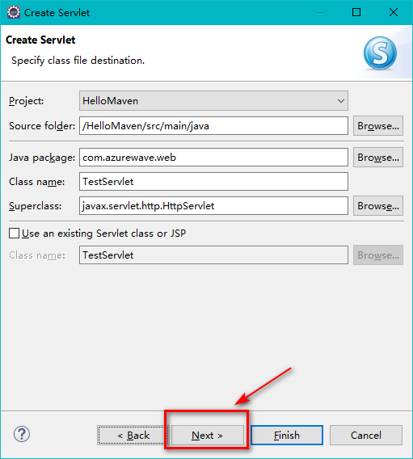

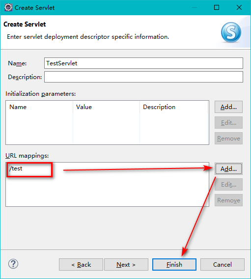

发现报错，需要添加依赖

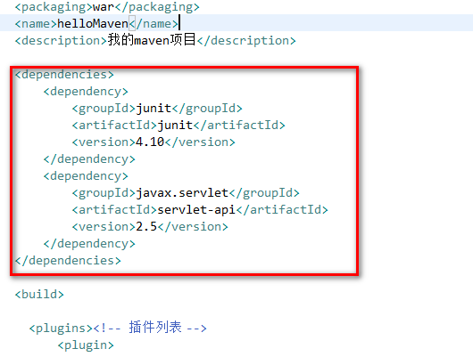

```xml
<dependencies>
	  <dependency>
		  <groupId>junit</groupId>
		  <artifactId>junit</artifactId>
		  <version>4.10</version>
	  </dependency>
	  <dependency>
		  <groupId>javax.servlet</groupId>
		  <artifactId>servlet-api</artifactId>
		  <version>2.5</version>
	  </dependency>
</dependencies>
```

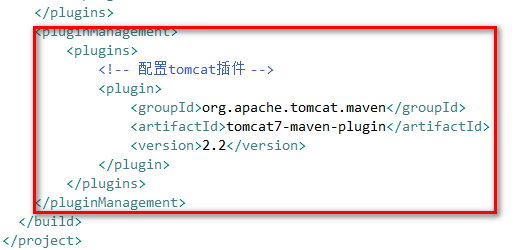

```xml
<pluginManagement>
    <plugins>
        <!-- 配置tomcat插件 -->
        <plugin>
            <groupId>org.apache.tomcat.maven</groupId>
            <artifactId>tomcat7-maven-plugin</artifactId>
            <version>2.2</version>
        </plugin>
    </plugins>
</pluginManagement>
```

运行项目

项目右击


在地址栏中输入http://localhost:8080/HelloMaven/test会报错

==cannot be cast to javax.servlet.Servlet==

解决办法：https://blog.csdn.net/weixin_38588501/article/details/80447039

修改依赖文件

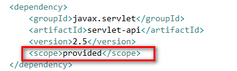

再次运行时正常


scope的作用域

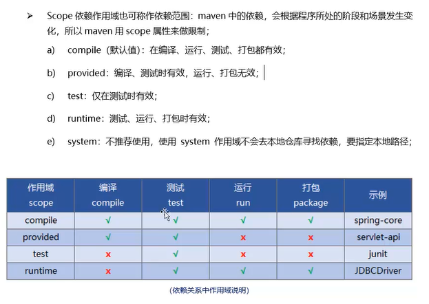

# maven3.6.1+tomcat9.0.8热部署

# 安装jar包到本地仓库

```
//指定jar包绝对路径
mvn install:install-file -DgroupId=com.alibaba -DartifactId=fastjson -Dversion=1.2.60 -Dpackaging=jar -Dfile=D:/fastjson-1.2.60.jar
//进入jar包目录后安装
mvn install:install-file -DgroupId=com.alibaba -DartifactId=fastjson -Dversion=1.2.60 -Dfile=fastjson-1.2.60.jar -Dpackaging=jar
```

# 打包时不包含指定目录
> 在pom.xml中添加如下配置，打包的使用会排除`/src/main/resources`目录
```xml
<build>
    <resources>
        <resource>
            <directory>/src/main/resources</directory>
            <filtering>true</filtering>
        </resource>
    </resources>
</build>
```