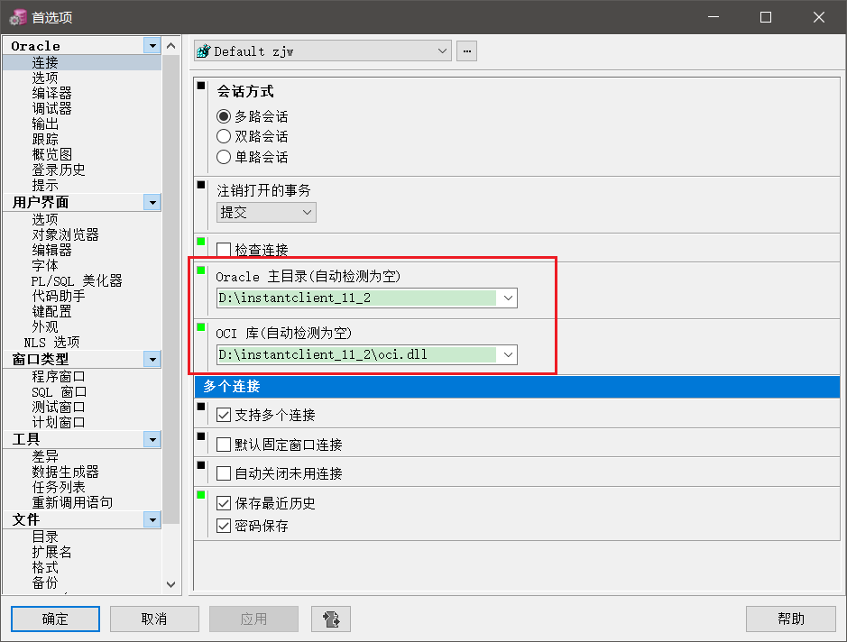

# 设置环境变量
```
ORACLE_HOME=D:\PLSQL Developer
TNS_ADMIN=D:\PLSQL Developer
NLS_LANG=AMERICAN_AMERICA.AL32UTF8
```

# 设置 tnsnames.ora
参看[tnsnames.ora](./tnsnames.ora)配置文件格式，文件放在D:\PLSQL Developer目录下。具体存放位置需要看安装位置。

# 配置快捷键
工具>首选项>编辑器>自动替换
```
u=UPDATE  SET WHERE
ins=INSERT
s=SELECT
f=FROM
w=WHERE
o=ORDER BY
d=DELETE
df=DELETE FROM
sf=SELECT * FROM
sc=SELECT COUNT(*) FROM
sfu=SELECT * FROM FOR UPDATE
cor=CREATE OR REPLACE
p=PROCEDURE
fn=FUNCTION
v=VIEW
sso=SET serveroutput ON;
di=DISTINCT
c=COUNT()
a=AND
ob=ORDER BY
```
可以保存到一个文件里面，参看[shortcuts.txt](./shortcuts.txt)

# 配置Oracle主目录和OCI库
