[TOC]

# 1 oracle下载安装

## 1.1 oracle下载

[oracle下载](https://www.oracle.com/technetwork/database/enterprise-edition/downloads/index.html)

> 需要登录oracle账号，本次下载的是oracle11 g，共两个文件

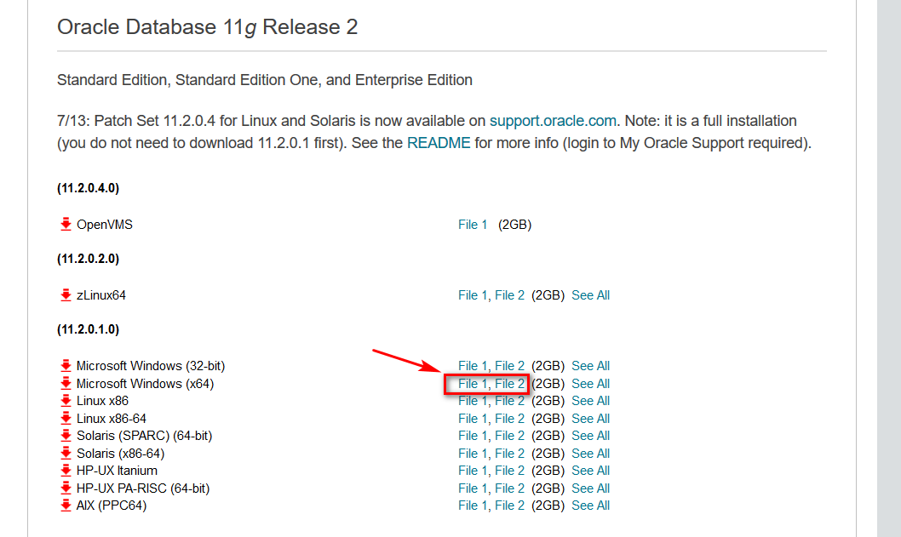

下载完成效果

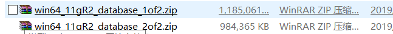

## 1.2 oracle安装

将两个压缩包解压，然后将第二个文件夹中的内容拷贝到第一个文件夹中。

然后双击setup.exe进行安装

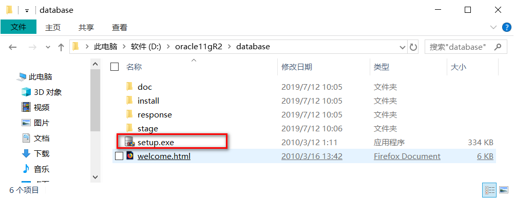

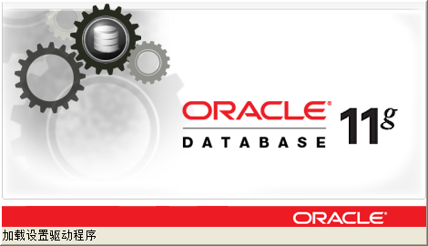

取消勾选，不接收更新，下一步

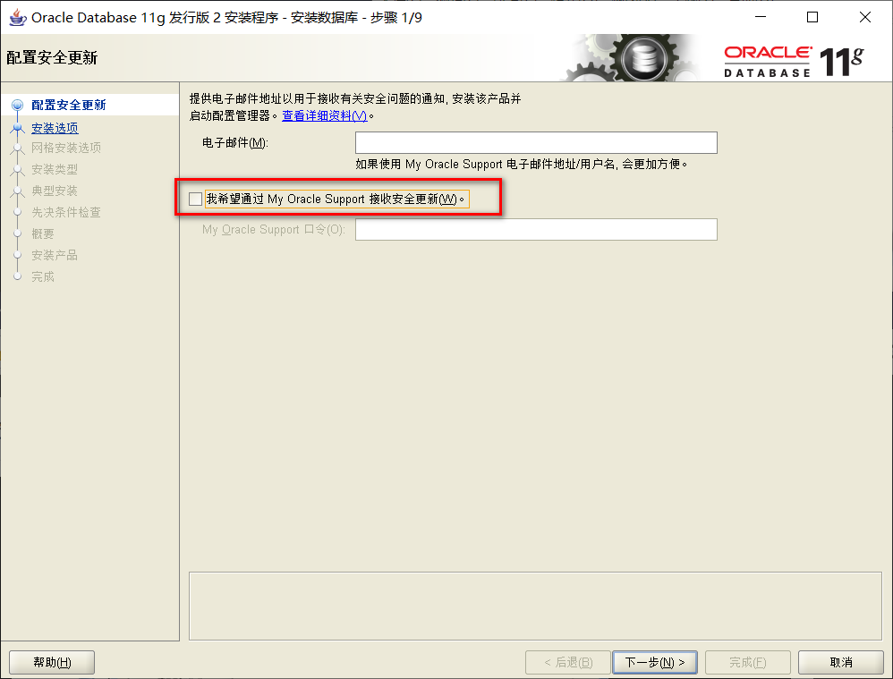

下一步


选择服务器类，下一步


单实例数据库安装，下一步

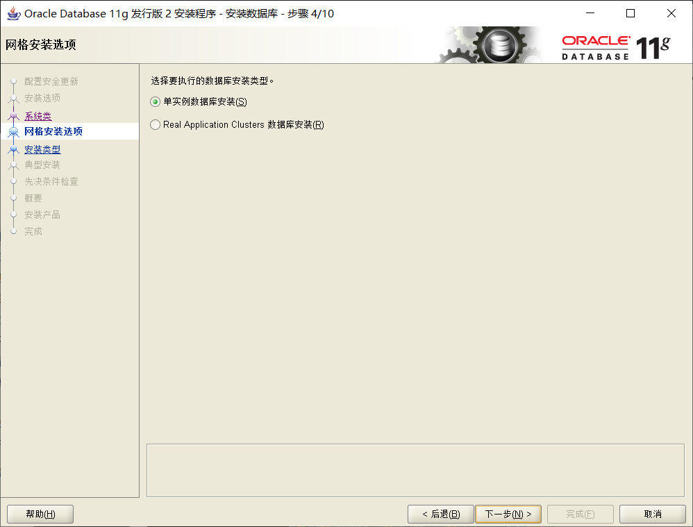

选择高级安装，下一步

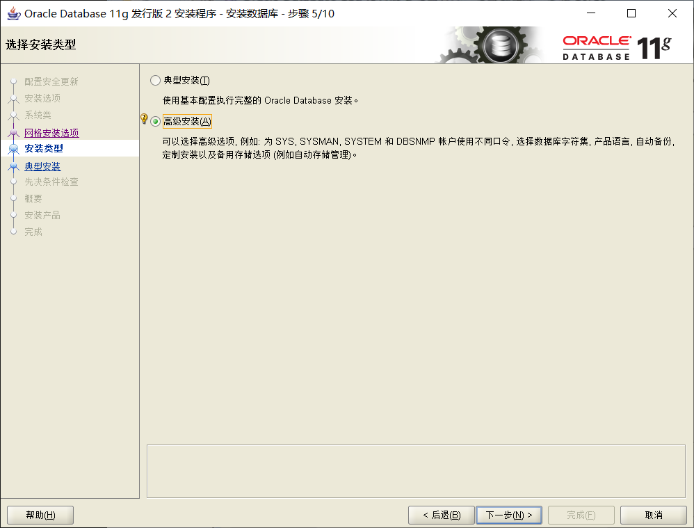

下一步


选择企业版，下一步


默认安装位置，下一步


选择一般用途/事务处理，下一步

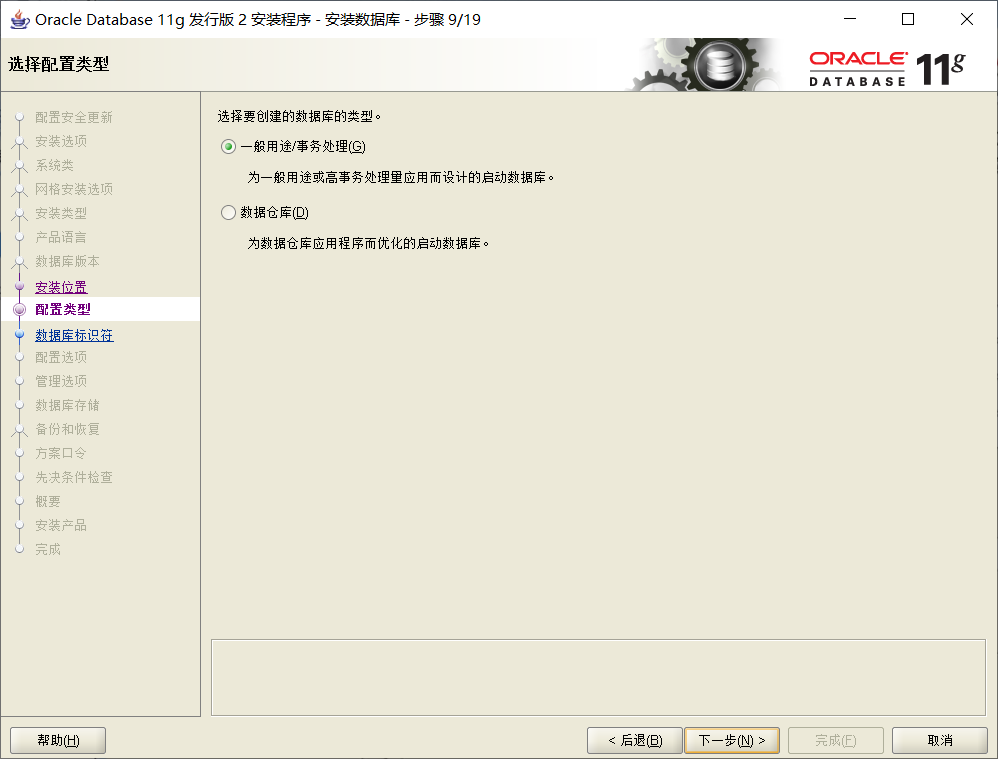

全局数据库名和Oracle服务标识符都选择默认，下一步


字符集选择UTF-8,实例方案选择创建具有实例方案的数据库，下一步

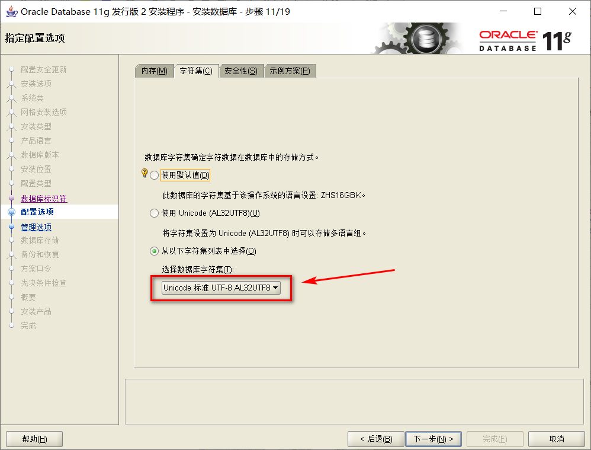


默认，下一步

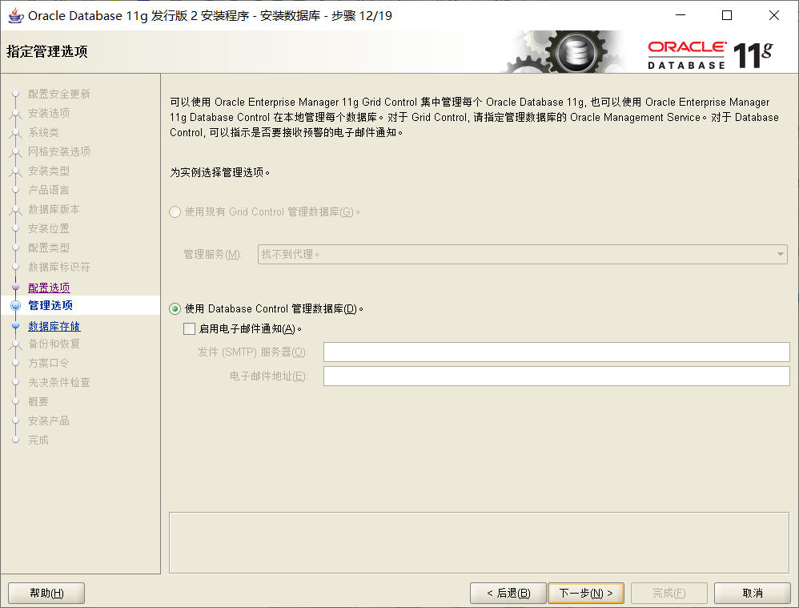

默认，下一步

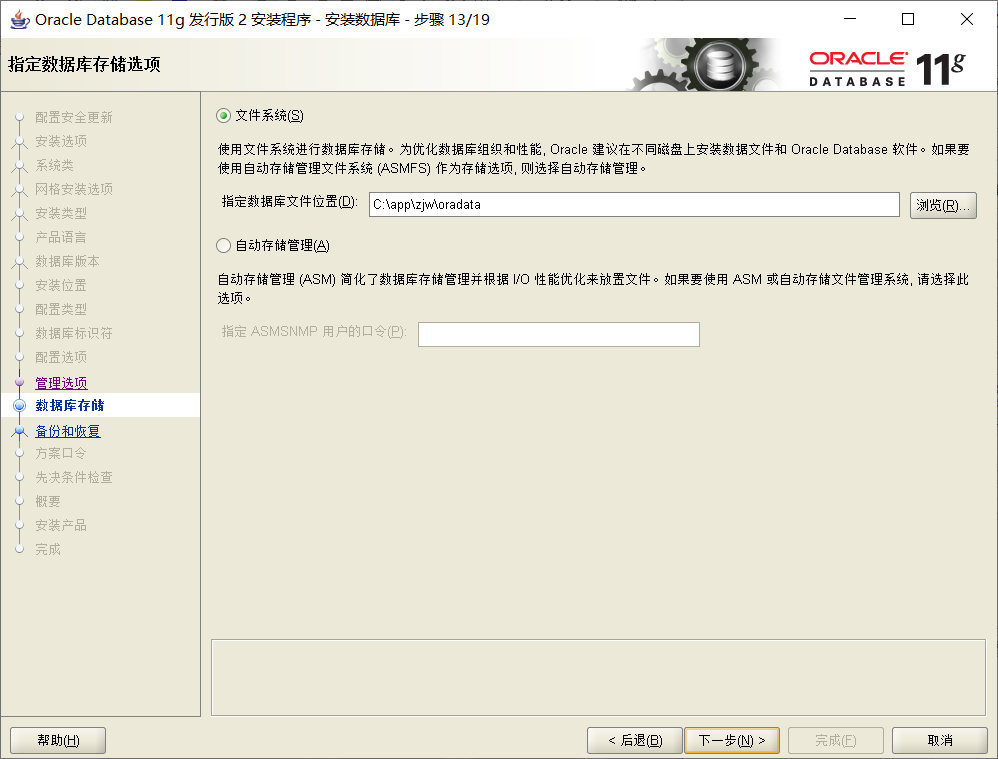

默认，下一步

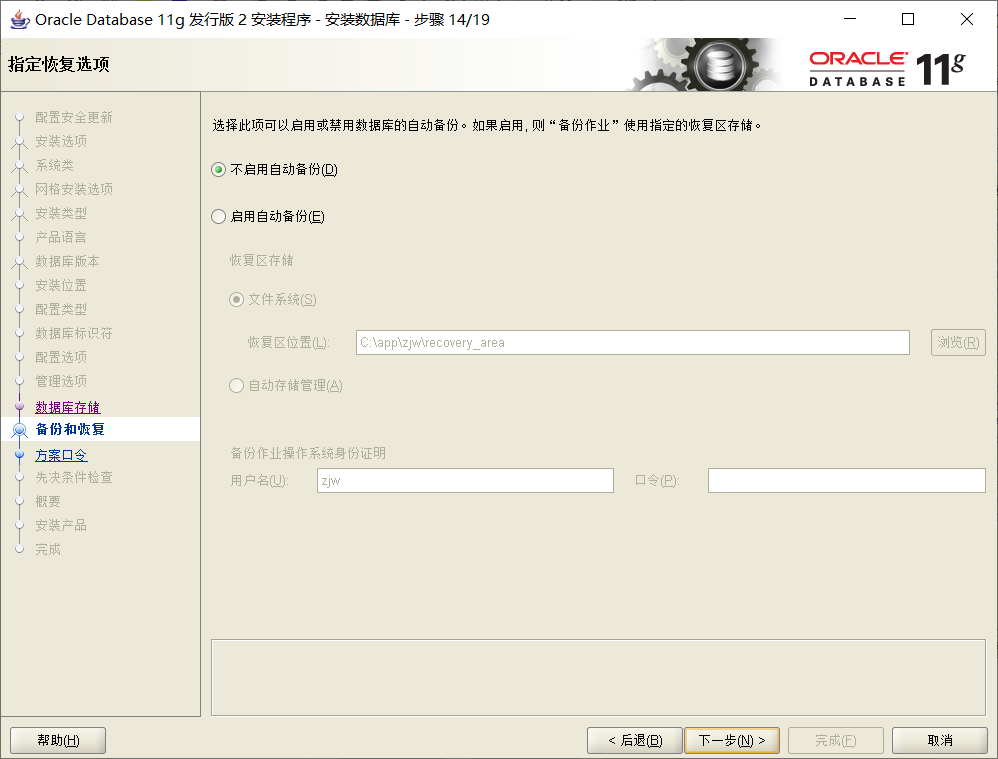

我们选择对所有账户使用相同的口令，设置为“Aa123456”,口令的设置建议如下


选择完成

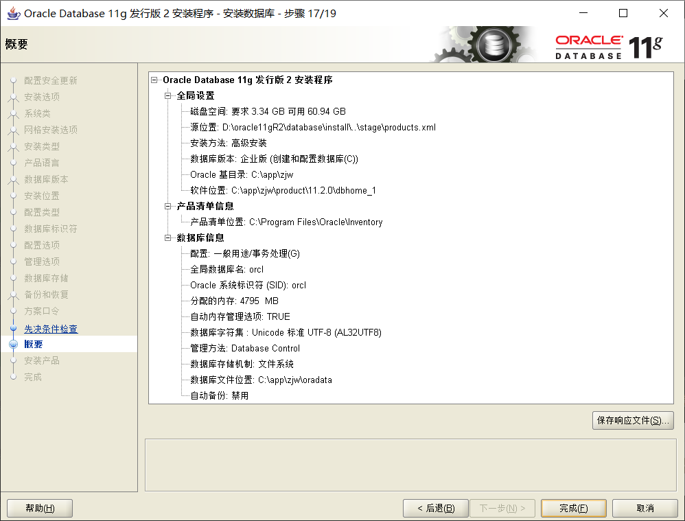

等待数据库的安装


有一个东西出错了，点确定

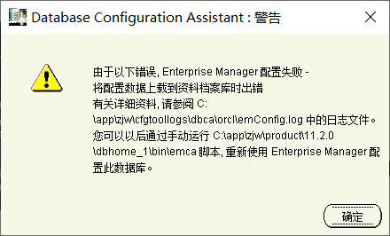

点击口令管理

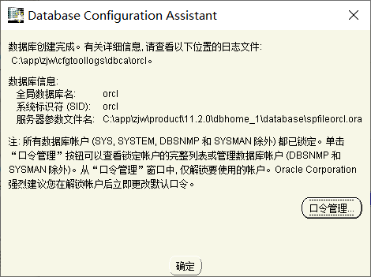

> 本次会自动地实现数据库的创建，但是每一个数据库都需要进行额外的配置。

> 口令管理程序，主要操作以下的几个用户（设置经典口令）：
>
> **超级管理员：sys / change_on_install**
>
> **普通管理员：system / manager**
>
> **普通用户：scott / tiger （需要解锁）**
>
> **大数据用户（样本数据库才有）：sh / sh (需要解锁)**

设置完口令后点击确定


选择是

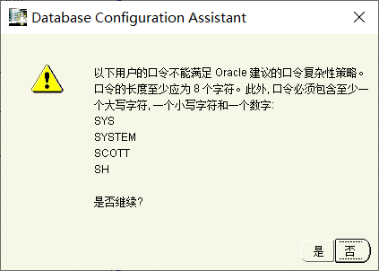

点击确定


安装完成，点击关闭


打开电脑的服务，可以看到oracle相关的服务，将所有自动开启的服务设置为手动打开方式。

以后打开oracle服务的时候只需要**打开两个服务**即可。

> OracleOraDb11g_home1TNSListener  监听服务，通过程序或不同客户端连接oracle数据库使用
>
> OracleServiceORCL 数据库的实例服务


## 1.3 oracle卸载

**oracle正常安装完成**

①使用oracle提供的卸载程序；


②重新启动电脑，进入到安全模式（启动时按住F8）；

③找到系统上的对应的磁盘路径，并且删除；

④隐形注册表命令“regedit.exe”，搜索所有与oracle有关的内容，并且删除；

⑤重启启动电脑后就可以重新执行安装。

**oracle安装失败**

执行上述的②~⑤步骤。

**不能解决**

百度或重装系统。

# 2 SQLPlus命令

## 2.1 登录数据库 

进入cmd命令行，输入sqlplus命令，输入用户名为scott，密码为tiger

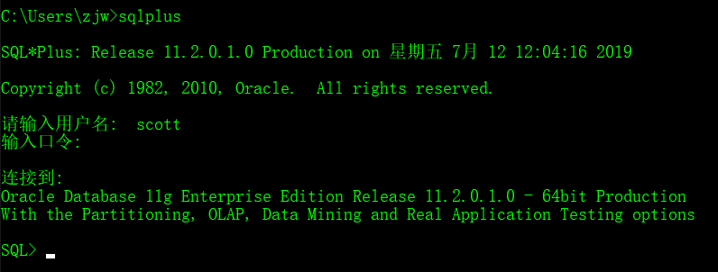

或者进入cmd后输入sqlplus scott/tiger


## 2.2 断开数据库的连接

输入exit指令


## 2.3 格式指令

> --每行长度为300
>
> --每页大小为30个数据
>
> SET LINESIZE 300;
>
> SET PAGESIZE 30;
>
> --设置某一列显示的长度（字符串）
>
> COL 列名 FOR A20；
>
> --设置某一列显示的长度（数字）
>
> COL 列名 FOR 9999；

## 2.4 切换用户

> CONN 用户名/密码 [AS SYSDBA]，如果是sys用户一定要加上SYSDBA

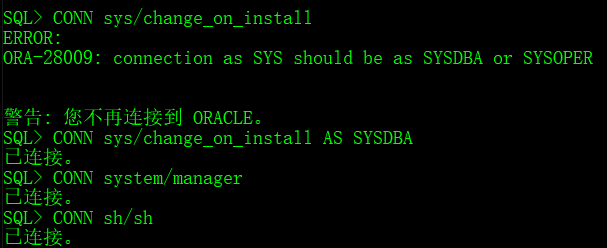

## 2.5 查看当前用户

> show user


## 2.6 调用系统命令

调用系统命令需要加上host前缀

>host echo helloworld

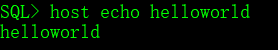

# 3 SQL简介&数据表分析

##  3.1 SQL简介

DML（data manipulation language）数据操纵语言：

就是我们最经常用到的 SELECT、UPDATE、INSERT、DELETE。

DDL

DCL

## 3.2 scott表的结构

### 3.2.1 查询一个用户下的所有表

>SELECT * FROM tab;


可以发现一共有四张表：emp（雇员表）、dept（部门表）、salgrade（工资等级表）、bouns（工资表）

```sql
--查看表结构
--DESC 表名;
DESC dept;
```

​	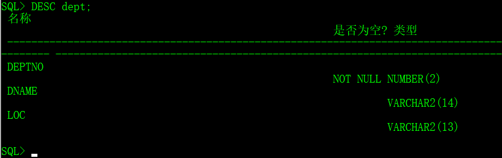

### 3.2.2 dept（部门信息表）

| No.  | 列名称 |     类型     |                描述                |
| :--: | :----: | :----------: | :--------------------------------: |
|  1   | DEPTNO |  NUMBER(2)   |  表示部门编号，最多由2位数字组成   |
|  2   | DNAME  | VARCHAR2(14) | 表示部门名称，最多由14个字符所组成 |
|  3   |  LOC   | VARCHAR2(13) |              部门位置              |

查看部门表

```sql
SELECT * FROM dept;
```


### 3.2.3 emp（雇员信息表）

| No.  |  列名称  |     类型     |                     描述                     |
| :--: | :------: | :----------: | :------------------------------------------: |
|  1   |  EMPNO   |  NUMBER(4)   |         雇员编号，最多由4位数字组成          |
|  2   |  ENAME   | VARCHAR2(10) |                   雇员姓名                   |
|  3   |   JOB    | VARCHAR2(9)  |                   雇员职位                   |
|  4   |   MGR    |  NUMBER(4)   |             每个雇员的领导的编号             |
|  5   | HIREDATE |     DATE     |        雇佣日期，里面包含有日期和时间        |
|  6   |   SAL    | NUMBER(7,2)  | 基本工资，小数点最多只占2位，整数最多只占5位 |
|  7   |   COMM   | NUMBER(7,2)  |    佣金，一般只有销售才会存在有佣金的概念    |
|  8   |  DEPTNO  |  NUMBER(2)   |    部门编号，指每个雇员对应的雇员编号信息    |

查看雇员表

```sql
SELECT * FROM emp;
```

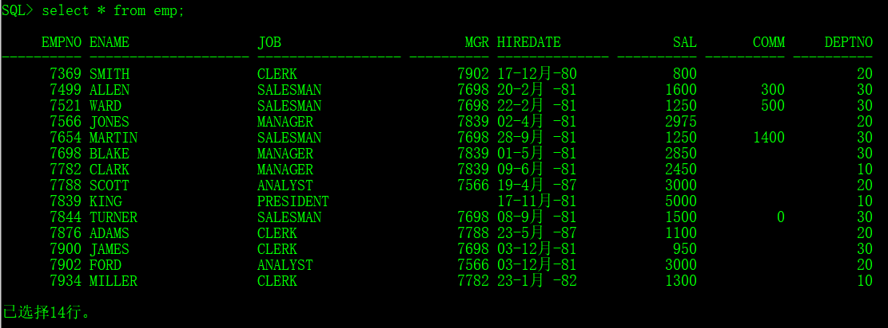

### 3.2.4 salgrade（工资等级表）

| No.  | 列名称 |  类型  |       描述       |
| :--: | :----: | :----: | :--------------: |
|  1   | GRADE  | NUMBER |   工资等级编号   |
|  2   | LOSAL  | NUMBER | 此等级的最低工资 |
|  3   | HISAL  | NUMBER | 此等级的最高工资 |

查看工资等级表

```sql
SELECT * FROM salgrade;
```

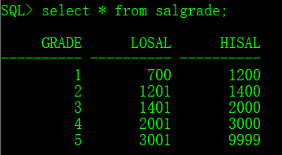

### 3.2.5 bonus（工资表）

| No.  | 列名称 |     类型     |   描述   |
| :--: | :----: | :----------: | :------: |
|  1   | ENAME  | VARCHAR2(10) | 雇员姓名 |
|  2   |  JOB   | VARCHAR2(9)  |   职位   |
|  3   |  SAL   |    NUMBER    | 基本工资 |
|  4   |  COMM  |    NUMBER    |   佣金   |

查看工资表

```sql
SELECT * FROM bonus;
```

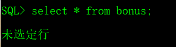

发现这是一张空表。

# 4 SQL简单查询

## 4.1 简单查询的基本格式

>SELECT [DISTINCT] * | 列名称 [别名],列名称 [别名],...
>
>FROM 表名称 [别名]；

## 4.2 查询案例

> 查询雇员全部信息

```sql
SELECT * FROM emp;
```

> 查询每个雇员的编号、姓名、职位、工资

```sql
SELECT empno,ename,job,sal FROM emp;
```


> 查询所有的职位信息，职位信息就是job列

```sql
--会产生重复列
SELECT job FROM emp;
--消除重复列
SELECT DISTINCT job FROM emp;
```


> 查询每个雇员的编号、姓名、基本年薪

```sql
SELECT empno,ename,sal*12 FROM emp;
--使用别名代替sal*12
SELECT empno,ename,sal*12 income FROM emp;
```

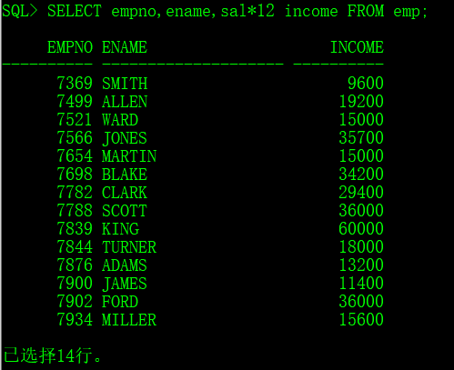

**在使用SELECT子句查询数据的时候，除了查询列实际上也可以设置一些常量，这些常量可以直接进行输出。但是对于常量也有如下的三点说明：**

​	**如果常量是字符串，则要求使用“ ’ ”声明，例如：‘hello’;**

​	**如果常量是数字，则直接编写，例如：10；**

​	**如果常量是日期，则按照日期风格格式编写，使用 ”xx日-xx月-xx年"，例如：‘17-12月-80’** 

> 直接查询常量

```sql
SELECT '雇员',empno,ename FROM emp ;
```

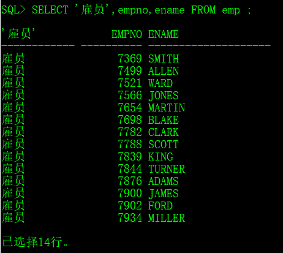

在进行简单查询操作里面，如果有需要也可以在SELECT子句里面用”||“连接查询结果。

> 观察连接效果

```sql
SELECT empno||ename FROM emp;
```

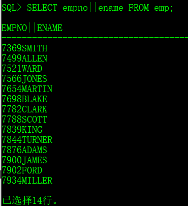

# 5 SQL限定查询

限定查询格式

> 【③控制要显示的数据列】SELECT [DISTINCT] * | 列名称 [别名]，列名称 [别名]，...
>
> 【①确定数据开源】FROM 表名称 [别名]
>
> 【②确定满足条件的数据行】[WHERE 过滤条件（s）]
>
> --WHERE子句中不能使用SELECT定义的别名

限定查询符号

> **关系运算符：>、<、>=、<=、<>(!=)**
>
> **逻辑运算符：AND、OR、NOT**
>
> **范围运算符：BETWEEN...AND**
>
> **谓词范围：IN、NOT IN**
>
> **空判断：IS NULL、IS NOT NULL**
>
> **模糊查询：LIKE**

## 5.1 关系运算符

> 查询出所有基本工资高于1500的雇员信息

```sql
SELECT *
FROM emp
WHERE sal>1500;
```

> 查询SMITH的完整信息

```sql
SELECT *
FROM emp
WHERE ename='SMITH';
```

> 查询工资是5000的雇员信息

```sql
SELECT *
FROM emp
WHERE sal=5000 ;
```

> 查询职位不是销售人员的雇员、姓名、职位

```sql
--方式一
SELECT empno,ename,job FROM emp WHERE job!= 'SALESMAN';
--方式二
SELECT empno,ename,job FROM emp WHERE job<>'SALESMAN';
```

## 5.2 逻辑运算符 

> 查询出工资范围在1500~3000之间的雇员信息

```sql
SELECT *
FROM emp
WHERE sal>=1500 AND SAL<=3000;
```

> 查询工资大于2000或职位是办事员的所有雇员信息

```sql
SELECT *
FROM emp
WHERE sal>2000 OR job='CLERK';
```

> 查询工资小于2000的雇员信息

```sql
--方式一
SELECT * FROM emp WHERE sal<2000;
--方式二
SELECT * FROM emp WHERE NOT sal>=2000;
```

## 5.3 范围查询

范围查询的语法格式

> **BETWEEN 最小值（数字、日期）AND 最大值**

> 查询工资在1500~2000之间的雇员（包含1500、2000）

```sql
SELECT * FROM emp WHERE sal>=1500 AND sal<=2000;
SELECT * FROM emp WHERE sal BETWEEN 1500 AND 2000;
```

> 日期在oracle中的表示
>
> 1981-01-01	表示为	'01-1月-81'	'01-1月-1981' 
>
> 1981-12-31	表示为	'31-12月-81'	'31-12月-1981' 

> 查询所有在1981年雇佣的雇员

```sql
SELECT * FROM emp 
WHERE hiredate BETWEEN '01-1月-81' AND '31-12月-1981';
```

## 5.4 空判断

> 查询所有领取佣金的雇员信息（佣金存在、不为空）

```sql
--方式一
SELECT * FROM emp
WHERE comm IS NOT NULL;
--方式二
SELECT * FROM emp
WHERE NOT comm IS NULL;
```

## 5.5 IN操作符

> 查询出雇员编号是7369、7566、7788、9999的雇员信息

```sql
SELECT * FROM emp
WHERE empno IN (7369,7566,7788,9999);
```

> 查询出雇员编号不是7369、7566、7788、9999的雇员信息

```sql
--方式一
SELECT * FROM emp
WHERE empno NOT IN (7369,7566,7788,9999);
--方式二
SELECT * FROM emp
WHERE NOT empno IN (7369,7566,7788,9999);
```

> IN操作中包含null--没有任何影响

```sql
SELECT * FROM emp WHERE empno IN (7369,7566,7788,null);
```

> NOT IN中包含null
>
> 如果有了null，就变成了查询全部数据了。
```sql
SELECT * FROM emp WHERE empno NOT IN (7369,7566,7788,null);
```

## 5.6 模糊查询

两个通配符

> **”_“：匹配任意的一位字符**
>
> **”%“：匹配一位或多位字符**

> 查询名字以字符A开头的雇员信息

```sql
SELECT * FROM emp WHERE ename LIKE 'A%';
```

> 查询名字第二个字符是以A开头的雇员信息

```sql
SELECT * FROM emp WHERE ename LIKE '_A%';
```

> 查询名字中含有字母A的雇员信息

```sql
SELECT * FROM emp WHERE ename LIKE '%A%';
```

> 查询工资中含有数字9的雇员信息

```sql
SELECT * FROM emp WHERE sal LIKE '%9%';
```

# 6 查询排序

## 6.1 查询排序格式

> 【③控制要显示的数据列】SELECT [DISTINCT] * | 列名称 [别名]，列名称 [别名]，...
>
> 【①确定数据开源】FROM 表名称 [别名]
>
> 【②确定满足条件的数据行】[WHERE 过滤条件（s）]
>
> 【④针对查询结果进行排序】[ORDER BY 字段[ASC|DESC]，字段[ASC|DESC]，...];
>
> --由于order by是在最后执行的，所以可以使用SELECT定义的别名

> **OREER BY子句默认是ASC（升序）**
## 6.2 查询案例

> 查询所有的雇员信息，要求按照工资由高到低排序

```sql
--如果有null的会排在前面
SELECT * FROM emp ORDER BY sal DESC;
--将是null值得排在后面
SELECT * FROM emp ORDER BY sal DESC NULLS LAST;
```

> 查询所有销售人员的信息，按照雇佣日期由早到晚排序（升序）

```sql
SELECT * FROM emp
WHERE job='SALESMAN'
ORDER BY hiredate ;
```

> 要求按照工资由高到低排序，如果工资相同，则按照雇佣日期由早到晚排序

```sql
SELECT * FROM emp
ORDER BY sal DESC,hiredate ;
```

> 查询每个雇员的编号、姓名、年薪，按照年薪由低到高排序

```sql
SELECT empno,ename,sal*12 income
FROM emp
ORDER BY income;
```

# 7 综合应用：查询练习

> 选择部门30中的所有员工

```sql
SELECT * FROM emp
WHERE deptno=30;
```

> 列出所有办事员(CLERK)的姓名，编号和部门编号

```sql
SELECT ename,empno,deptno 
FROM emp 
WHERE job='CLERK';
```

> 找出佣金高于薪金的60%的员工

```sql
SELECT * FROM emp
WHERE comm>sal*0.6;
```

> 找出部门10中所有经理（MANAGER）和部门20中所有办事员（CLERK）的详细资料

```sql
SELECT * FROM emp
WHERE (deptno=10 AND job='MANAGER')
	OR (deptno=20 AND job='CLERK');
```

> 找出部门10中所有经理（MANAGER），部门20中所有办事员（CLERK），既不是经理又不是办事员但其薪金大于或等于2000的所有员工的详细资料

```sql
SELECT * FROM emp
WHERE (deptno=10 AND job='MANAGER')
	OR (deptno=20 AND job='CLERK')
	OR (job NOT IN('MANAGER','CLERK') AND sal>=2000);
```

> 找到收取佣金的员工的不同工作

```SQL
SELECT DISTINCT job
FROM emp
WHERE NOT comm IS NULL;
```

> 找到不收取佣金或收取的佣金低于100的员工

```sql
SELECT * FROM emp
WHERE comm IS NULL OR comm<100;
```

> 显示不带有”R“的员工的姓名

```sql
SELECT ename FROM emp
WHERE ename NOT LIKE '%R%';
```

> 显示姓名字段的任何位置包含”A“的所有员工的姓名，显示的结果按照基本工资由高到低排序，如果基本工资相同，则按照雇佣年限由早到晚排序，如果雇佣日期相同，则按照职位排序

```SQL
SELECT * FROM emp
WHERE ename NOT LIKE '%A%'
ORDER BY sal DESC,
		hiredate ASC,
		job;
```

# 8 单行函数

> **概念：**所谓的单行函数指的就是完成某一具体功能的操作函数，例如：转大写、或者说进行日期格式的转换等等，一般而言，单行函数的格式：”返回值 函数名称（参数）“
>
> 单行函数按照类型一共分为以下几种：字符串函数、数值函数、日期函数、转换函数、通用函数

## 8.1 字符串函数

| No.  |                  函数名称                   |                             描述                             |
| :--: | :-----------------------------------------: | :----------------------------------------------------------: |
|  1   |         字符串 UPPER(列 \| 字符串)          |                将传入的字符串变为大写字母形式                |
|  2   |         字符串 LOWER(列 \| 字符串)          |                将传入的字符串变为小写字母形式                |
|  3   |        字符串 INITCAP(列 \| 字符串）        |            开头首字母大写，其它的字母全部变为小写            |
|  4   |         数字 LENGTH (列 \| 字符串)          |                     取得指定字符串的长度                     |
|  5   | 字符串 SUBSTR(列\|字符串，开始索引，[长度]) | 进行字符串的截取，如果没有设置长度，表示从开始索引一直截取到结尾 |
|  6   | 字符串 REPLACE(列\|字符串，旧内容，新内容） |             将指定字符串的数据以新数据替换旧数据             |
|  7   |          字符串 TRIM(列\|字符串）           |                   去点字符串左右两边的空格                   |

> 在Oracle里面，所有的函数如果要想进行验证，也必须编写SQL语句。为了方便用户进行一些验证或者是一些不需要查询表的查询操作，专门提供了一个dual的虚拟表。

> 转大写、小写操作

```sql
SELECT UPPER('hello') FROM dual;
```

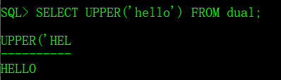

```sql
SELECT LOWER(ename) FROM emp;
```

> 用户输入要查询的雇员姓名，而后显示雇员的完整信息

在Oracle里面如果要想实现数据的输入操作可以使用替代变量的方式完成，格式“&标记”

```sql
SELECT * FROM emp 
WHERE ename=UPPER('&inputname');
```


> 将雇员的姓名以首字母大写的形式保存

```sql
SELECT ename,INITCAP(ename) FROM emp;
```


> 取得字符串的长度

```sql
SELECT LENGTH('helloworld!!!') FROM dual;
```


> 查询雇员姓名长度为5的全部雇员信息

```sql
SELECT * FROM emp WHERE LENGTH(ename)=5;
```

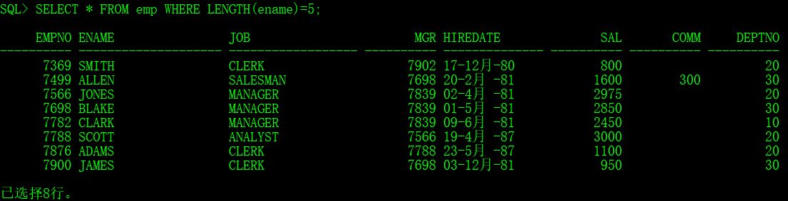

> 字符串截取：
>
> 在长须之中所有的字符串的首字母的索引都是0，但是在Oracle里面，所有的字符串的首字母的索引都是1，如果你设置的是0，那么他也会按照1的方式进行处理。

> 验证

```sql
SELECT SUBSTR('helloworld',6) FROM dual;
SELECT SUBSTR('helloworld',0,5) FROM dual;
SELECT SUBSTR('helloworld',1,5) FROM dual;
```


> 截取每个雇员姓名的前三个字母

```sql
SELECT ename,SUBSTR(ename,1,3) FROM emp;
```

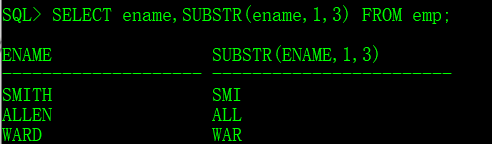

> 截取每个雇员姓名的后三位字母

```sql
SELECT ename,SUBSTR(ename,LENGTH(ename)-2) FROM emp;
SELECT ename,SUBSTR(ename,-3) FROM emp; 
```

> 去掉 ‘  hello  ’字符串左右两边的空格

```sql
SELECT TRIM('  hello  ') FROM dual;
```


## 8.2 数值函数

| No.  |             函数名称              |                  描述                  |
| :--: | :-------------------------------: | :------------------------------------: |
|  1   | 数字 ROUND(列 \| 数字 [，小数点]) | 实现数据的四舍五入，可以设置保留小数位 |
|  2   | 数字 TRUNC(列 \| 数字 [，小数点]) |       实现数据的截取，即：不进位       |
|  3   | 数字 MOD(列  \| 数字 [，小数点])  |            求模（计算余数）            |

> **==使用ROUND()函数==**
>
> 如果灭有设置小数点的保留位数，那么会直接保留到个位

```sql
--不设置保留位数
SELECT ROUND(789.56823) FROM dual;
--设置保留小数点后两位
SELECT ROUND(789.56823,2) FROM dual;
--设置保留小数点前两位
SELECT ROUND(789.56823,-2) FROM dual;
```

> **==使用TRUNC()函数==**

```sql
SELECT TRUNC(729.567123),
		TRUNC(729.567123,2),
		TRUNC(729.567123,-2)
FROM dual;
```

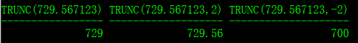

> **==求模函数==**

```SQL
--结果为1
SELECT MOD(10,3) FROM dual;
```

## 8.3 日期函数

> Oracle里面专门提供了一个伪例“**SYSDATE**”(**SYSTIMESTAMP**)，查询的是系统(计算机)的当前时间

```SQL
SELECT SYSDATE FROM dual;
SELECT SYSTIMESTAMP FROM dual;
```

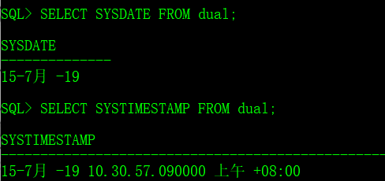

> 日期操作公式
>
> - 日期 + 数字 = 日期 （表示若干天之后的日期）
> - 日期 - 数字 = 日期 （表示若干天之前的日期）
> - 日期 - 日期 = 数字 （天数） 

> 日期的基本操作

```sql
SELECT SYSDATE-7,SYSDATE+120 FROM dual;
```

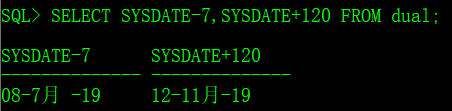

> 查询出每个雇员的编号、姓名、职位、已经被雇佣的天数

```sql
SELECT empno,ename,job,SYSDATE-hiredate FROM emp;
```


> 如果直接使用天数来实现年或月的计算，那么最终的结果一定是不准确的
>
> 为了准确的进行日期操作，在Oracle里面提供有四个日期处理函数

| No.  | 函数名称                                        | 描述                                 |
| :--: | :---------------------------------------------- | :----------------------------------- |
|  1   | 日期 **ADD_MONTHS**(列 \| 日期，月数)           | 在指定的日期上增加若干个月之后的日期 |
|  2   | 数字 **MONTHS_BETWEEN**(列 \| 日期，列 \| 日期) | 返回两个日期之间的所经历的月数       |
|  3   | 日期 **LAST_DAY**(列 \| 日期)                   | 取得指定日期所在月的最后一天         |
|  4   | 日期 **NEXT_DAY**(列 \| 日期，星期X)            | 返回下一个指定的一周时间数对应的日期 |

> 在当前下增加指定的月份

```sql
SELECT ADD_MONTHS(SYSDATE,4),
		ADD_MONTHS(SYSDATE,20),
		ADD_MONTHS(SYSDATE,300)
FROM dual;
```

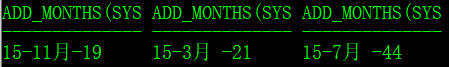

> 计算所有雇员到今天为止雇佣的月数

```sql
SELECT empno,ename,hiredate,MONTHS_BETWEEN(SYSDATE,hiredate) FROM emp;
```


> 计算当前时间所在月的最后一天日期

```sql
SELECT LAST_DAY(SYSDATE) FROM dual;
```

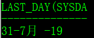

> 要求查询出所有在雇佣所在月倒数第三天雇佣的雇员信息

```sql
SELECT empno,ename,hiredate,LAST_DAY(hiredate)-2
FROM emp
WHERE hiredate=LAST_DAY(hiredate)-2;
```

> 下一个周二的日期

```sql
--下个周二
SELECT NEXT_DAY(SYSDATE,'星期二') FROM dual;
--下下个周二
SELECT NEXT_DAY(NEXT_DAY(SYSDATE,'星期二'),'星期二') FROM dual;
```

## 8.4 转换函数

数字型、字符串型、日期型三类数据的相互转换。


| No.  | 函数名称                                      | 描述                                             |
| :--: | --------------------------------------------- | ------------------------------------------------ |
|  1   | 字符串  TO_CHAR(列 \| 日期 \| 数字，转换格式) | 将日期或数字格式化为指定结构的字符串             |
|  2   | 日期 TO_DATE(列 \| 字符串，转换格式)          | 按照指定的转换格式编写字符串后将其变为日期型数据 |
|  3   | 数字 TO_NUMBER(列 \| 字符串)                  | 将字符串转为数字                                 |

**转字符串函数：TO_CHAR()**

> 如果想将一个日期或数字变为字符串，那么首先必须清楚转换格式的标记(不区分大小写)：
>
> 	- 日期：年(yyyyy)、月(mm)、日(dd)；
> 	- 时间：时(hh、hh24)、分(mi)、秒(ss);
> 	- 数字：任意数字(9)、本地货币符号(L);

> 将日期格式化显示

```sql
SELECT TO_CHAR(SYSDATE,'yyyy-mm-dd') FROM dual;
SELECT TO_DATE(SYSDATE,'yyyy-mm-dd hh:mi:ss') FROM dual;
SELECT TO_NUMBER(SYSDATE,'yyyy-mm-dd hh24:mi:ss') FROM dual;
```


> 实现日期数据的拆分

```sql
SELECT TO_CHAR(SYSDATE,'YYYY'),TO_CHAR(SYSDATE,'MM'),TO_CHAR(SYSDATE,'DD')
FROM dual;
```

> 要求查询所有在2月份雇佣的雇员

```sql
--方式一
SELECT * FROM emp WHERE TO_CHAR(hiredate,'mm')='02';
--方式二
SELECT * FROM emp WHERE TO_CHAR(hiredate,'mm')=2;
```

*Oracle之中提供有自动的转型操作，如果发现类型不匹配会自动地完成类型匹配后再进行比较。*

> 格式化数字

```SQL
SELECT TO_CHAR(34545462345,'L999,999,999,999') FROM dual;
```

**转日期函数**

> 将字符串变为日期

```sql
SELECT TO_DATE('2019-07-15','yyyy-mm-dd') FROM dual;
```

**转数字函数**

> TO_BUMBER()可以将一个字符串变为数字操作

```SQL
--结果都是3
SELECT TO_NUMBER('1') + TO_NUMBER('2') FROM dual;
SELECT '1'+'2' FROM dual;
```

## 8.5 通用函数

*一般指Oracle特有函数*

| No.  | 函数名称                                                     | 描述                                                         |
| :--: | :----------------------------------------------------------- | :----------------------------------------------------------- |
|  1   | 数字 NVL(列 \| NULL，默认值)                                 | 如果传入的内容是null，则使用默认数值处理，如果不是null则使用原始数值处理 |
|  2   | 数据类型 DECODE(列 \| 字符串\|数值，比较内容1，显示内容1，比较内容2，显示内容2，...[，默认显示内容]) | 设置的内容会与每一个比较内容进行比较，如果内容相同，则会使用显示内容进行输出，如果都不相同，则使用默认显示内容 |

> 查询出每个雇员的编号、姓名、基本工资、佣金、年薪

```sql
SELECT empno,ename,sal,comm,(sal+comm)*12 FROM emp;
```


*发现计算之后，没有佣金的雇员就没有年薪存在了，因为佣金为null的时候所做的任何计算结果都是nul。所以在这个时候为了保证计算的准确性，必须将null替换为0，那么这就属于NVL()函数的作用范畴了。*

```sql
SELECT empno,ename,sal,comm,(sal+NVL(comm,0))*12 FROM emp;
```


> 将所有的职位信息替换为中文显示

```sql
SELECT ename,job,DECODE(job,'CLERK','办事员','SALESMAN','销售','MANAGER','经理','ANALYST','分析员','PRESIDENT','总裁','---') FROM emp;
```

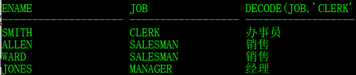

