[TOC]

# 9 多表查询

## 9.1 多表查询的基本概念

emp表中有14条记录，dept表中有4条记录。

> 实现多表查询

```SQL
SELECT * FROM emp,dept;
```

会发现查询的结果中一种有**56条记录**=**14*4**，这是**笛卡尔积**问题


**==多表查询性能一定是很差的，在开发之中应该尽可能回避！特别是在数据量大的时候。==**

> 显示每个雇员的编号、姓名、职位、工资、部门名称、部门位置

```sql
SELECT e.empno,e.ename,e.job,e.sal,d.dname,d.loc
FROM emp e,dept d
WHERE e.deptno=d.deptno;
```

> 显示每个雇员的编号、姓名、职位、工资、工资等级

```SQL
SELECT e.empno,e.ename,e.job,e.sal,s.grade
FROM emp e,salgrade s
WHERE e.sal BETWEEN s.losal AND s.hisal;
```

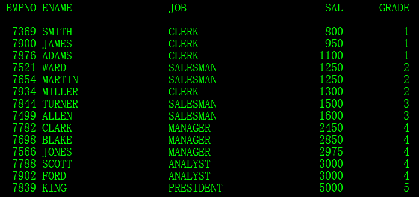

> 显示每个雇员的编号、姓名、职位、工资、工资等级、部门名称

```sql
SELECT e.empno,e.ename,e.job,e.sal,s.grade,d.dname
FROM emp e,salgrade s,dept d
WHERE e.sal BETWEEN s.losal AND s.hisal
		AND e.deptno=d.deptno;
```

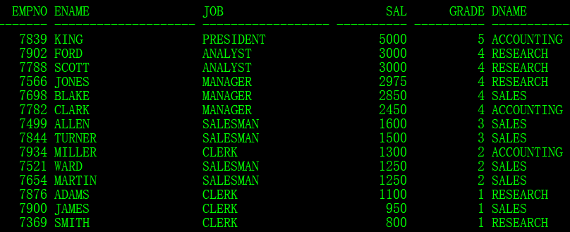

## 9.2 表的连接

> - 内连接（等值连接）：所有满足条件的数据都会被显示出来；
> - 外连接（左外连接、右外连接、全外连接）：控制左表与右表的数据是否全部显示。

**几种连接的关系**

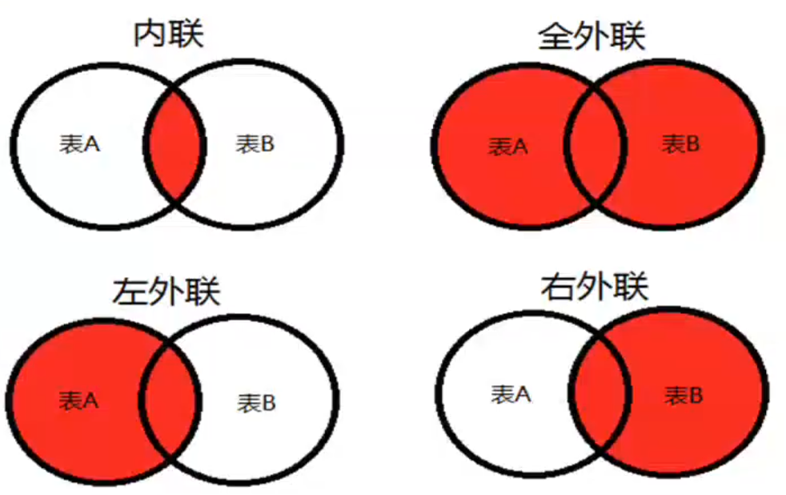

为了更好的描述当前的问题，下面向emp表之中增加一行记录，此纪录属于没有部门的雇员。

```sql
INSERT INTO emp(empno,ename,job) VALUES(8888,'张三','CLERK');
```

**1、内连接（等值连接）**

之前使用的都是等值连接

```sql
SELECT e.empno,e.ename,e.job,d.deptno,d.dname,d.loc
FROM emp e,dept d
WHERE e.deptno=d.deptno;

SELECT e.empno,e.ename,e.job,d.deptno,d.dname,d.loc
FROM emp e JOIN dept d
ON e.deptno=d.deptno;
```

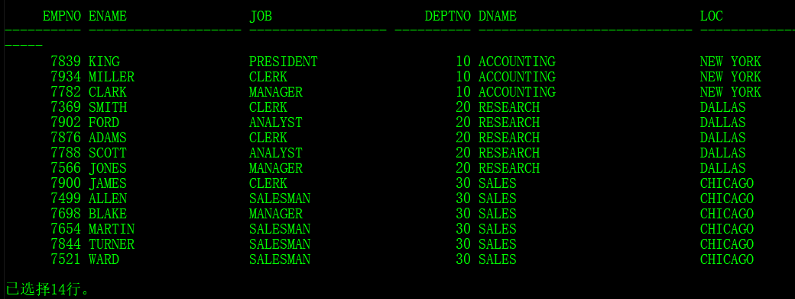

只有emp表和dept表都含有的数据才会被显示出来。

**2、外连接**

> - 左外连接：字段 = 字段（+）；
> - 右外连接：字段（+）= 字段；

观察==左外连接==

```sql
--方式一
SELECT e.empno,e.ename,e.job,d.deptno,d.dname,d.loc
FROM emp e, dept d
WHERE e.deptno=d.deptno(+);
--方式二
SELECT e.empno,e.ename,e.job,d.deptno,d.dname,d.loc
FROM emp e LEFT OUTER JOIN dept d
ON e.deptno=d.deptno;
--方式三
SELECT e.empno,e.ename,e.job,d.deptno,d.dname,d.loc
FROM emp e LEFT JOIN dept d
ON e.deptno=d.deptno;
```

**全部雇员**(左表)的信息可以正常显示出来。

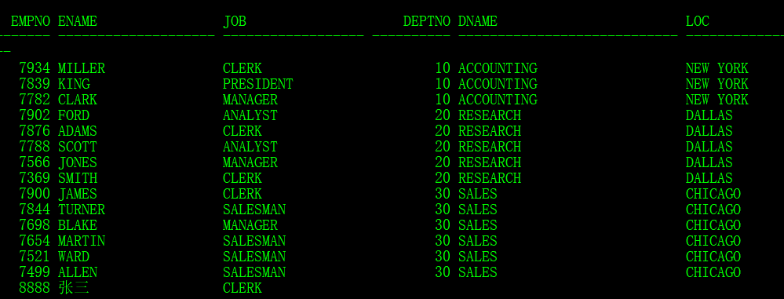

观察==右外连接==

```sql
--方式一
SELECT e.empno,e.ename,e.job,d.deptno,d.dname,d.loc
FROM emp e, dept d
WHERE e.deptno(+)=d.deptno;
--方式二
    SELECT e.empno,e.ename,e.job,d.deptno,d.dname,d.loc
    FROM emp e RIGHT OUTER JOIN dept d
    ON e.deptno=d.deptno;
--方式三
SELECT e.empno,e.ename,e.job,d.deptno,d.dname,d.loc
FROM emp e RIGHT JOIN dept d
ON e.deptno=d.deptno;
```

**所有部门**(右边表)的信息可以显示出来。


观察全外连接

```sql
--方式一
SELECT e.empno,e.ename,e.job,d.deptno,d.dname,d.loc 
FROM emp e FULL OUTER JOIN dept d
ON e.deptno=d.deptno;
--方式二
SELECT e.empno,e.ename,e.job,d.deptno,d.dname,d.loc 
FROM emp e FULL JOIN dept d
ON e.deptno=d.deptno;
```

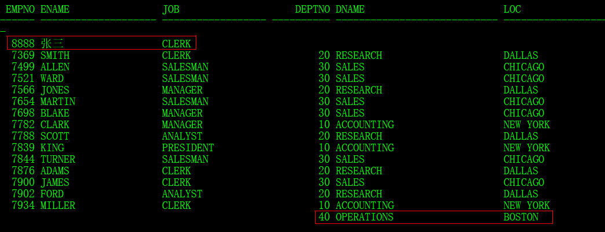

两张表的数据都被查出来了

## 9.3 SQL:1999语法支持

"(+)"标记是Oracle才有的。SQL:1999语法定义的多表查询的结构如下：

> SELECT [DISTINCT] * | 列 [别名]
>
> FROM 表名称1
>
> ​			[CROSS JOIN 表名称2]
>
> ​			[NATURAL JOIN 表名称3]
>
> ​			[JOIN 表名称 ON(条件) | USING (字段)]
>
> ​			[LEFT | RIGHT | FULL OUTER JOIN 表名称2]；

**1、交叉连接**：CROSS JOIN，主要的功能是产生笛卡尔积，简单的实现多表查询

```sql
SELECT * FROM emp CROSS JOIN dept;
```

**2、自然连接**：NATURAL JOIN , 自动使用关联字段消除笛卡尔积（一般关联字段是外键，但是此外它是以名称相同为主），属于内连接的概念。

```sql
SELECT * FROM emp NATURAL JOIN dept ;
```

**3、USING 子句**：如果说现在要一张表里面有多个关联字段存在，那么可以使用USING子句明确的设置一个关联字段。

```sql
SELECT * FROM emp JOIN dept USING(deptno);
```

**4、ON子句**：如果现在没有关联字段，则可以使用ON子句设置条件。

```sql
SELECT * FROM emp e JOIN salgrade s ON(e.sal BETWEEN s.losal AND s.hisal);
```

**5、外连接**

左外连接

```sql
SELECT * FROM emp LEFT OUTER JOIN dept USING(deptno);
```

右外连接

```sql
SELECT * FROM emp RIGHT OUTER JOIN dept USING(deptno);
```

全外连接

```SQL
SELECT * FROM emp FULL OUTER JOIN dept USING(deptno);
```

## 9.4 数据集合操作

四种操作符：UNION、UNION ALL、INTERSECT、MINUS

**UNION**:两个结果合并，去点重复数据

```sql
SELECT empno,ename,job FROM emp WHERE deptno=10
UNION
SELECT empno,ename,job FROM emp;
```

**UNION ALL**:两个结果合并，重复数据显示

```sql
SELECT empno,ename,job,deptno FROM emp WHERE deptno=10
UNION ALL
SELECT empno,ename,job,deptno FROM emp;
```

**INTERSECT**:两个结果取交集

```sql
SELECT empno,ename,job,deptno FROM emp WHERE deptno=10
INTERSECT
SELECT empno,ename,job,deptno FROM emp;
```

**MINUS**:两个结果取差集

```sql
SELECT empno,ename,job,deptno FROM emp 
MINUS
SELECT empno,ename,job,deptno FROM emp WHERE deptno=10;
```

# 10 分组统计查询

## 10.1 统计函数

**五个统计函数**

>- COUNT(* | [DISTINCT]字段)
>- MAN(字段)
>- MIN(字段)
>- SUM(字段)
>- AVG(字段)

> 查询所有雇员之中最高和最低工资

```sql
SELECT MAX(sal),MIN(sal) FROM emp;
```

> 查询所有雇员的最早雇佣和最晚雇佣的雇佣日期

```sql
SELECT MAX(hiredate),MIN(hiredate) FROM emp;
```

> 统计出所有雇员的总工资以及平均工资

```sql
SELECT SUM(sal),AVG(sal) FROM emp;
```

> 统计出雇员的平均服务年限

```sql
SELECT TRUNC(AVG(MONTHS_BETWEEN(SYSDATE,hiredate)/12)) FROM emp;
```

==**面试题**==：请解释**COUNT(*)**、**COUNT(字段)**、**COUNT(DISTINCT 字段)**的区别？

> - COUNT(*):明确的返回表中的数据个数，是最准确的；
> - COUNT(字段):不统计为null的数据个数，如果某一列的数据不可能为空，那么结果与COUNT(*)相同；
> - COUNT(DISTINCT 字段):统计消除掉重复数据后的数据个数。

## 10.2 分组统计查询

**GROUP BY子句**

> 【④确定要使用的数据列】SELECT [DISTINCT] 分组字段 [别名]，...|统计函数
>
> 【①确定要查找的数据来源】FROM 
>
> [【②针对数据进行筛选】WHERE 过滤条件(s)]
>
> [【③针对数据实现分组】GROUP BY 分组字段，分组字段，...]
>
> [【⑤针对返回结果进行排序】ORDER BY 字段[ASC|DESC],...];

> 按照职位分组，统计出每个职位的名称、人数、平均工资

```sql
SELECT job,COUNT(empno),AVG(sal)
FROM emp
GROUP BY job;
```

> 查询出每个部门编号，以及每个部门的人数、最高与最低工资

```sql
SELECT deptno,COUNT(empno),MAX(sal),MIN(sal)
FROM emp
GROUP BY deptno;
```

**分组操作的限制**

- 限制一：在没有编写GROUP BY子句的时候（全表做为一组），那么SELECT子句之中只允许出现统计函数，不允许出现其他字段

  | 错误的代码                          | 正确的代码                    |
  | ----------------------------------- | ----------------------------- |
  | SELECT COUNT(empno),ename FROM emp; | SELECT COUNT(empno) FROM emp; |

- 限制二：在使用GROUP BY子句分组时，SELECT 子句之中只允许出现分组字段与统计函数，其他字段不允许出现

  | 错误的代码                                             | 正确的代码                                     |
  | ------------------------------------------------------ | ---------------------------------------------- |
  | SELECT job,COUNT(empno) ，ename FROM emp GROUP BY job; | SELECT job,COUNT(empno) FROM emp GROUP BY job; |

- 限制三：统计函数允许嵌套查询，但是嵌套后的统计查询中，SELECT 子句里面不允许再出现任何字段，包括分组字段，只能够使用嵌套的统计函数。

  | 错误的代码                                            | 正确的代码                                     |
  | ----------------------------------------------------- | ---------------------------------------------- |
  | SELECT deptno,MAX(AVG(sal)) FROM emp GROUP BY deptno; | SELECT MAX(AVG(sal)) FROM emp GROUP BY deptno; |

> 查询每个部门的名称、人数、平均工资

```sql
SELECT d.dname,COUNT(e.empno),AVG(e.sal)
FROM emp e,dept d
WHERE e.deptno(+)=d.deptno
GROUP BY d.dname;
```

> 查询出每个部门的编号、名称、位置、部门人数、平均服务年限

```sql
SELECT d.deptno,d.dname,d.loc,COUNT(e.empno),TRUNC(AVG(MONTHS_BETWEEN(SYSDATE,hiredate)/12))
FROM emp e,dept d
WHERE e.deptno(+)=d.deptno
GROUP BY d.deptno,d.dname,d.loc;
```

> 查询平均工资高于2000的职位名称以及平均工资

```sql
--报错
SELECT job,AvG(sal)
FROM emp
WHERE AVG(sal)>2000
GROUP BY job;
```

WHERE子句上不允许使用分组函数。之所以不能使用，是因为统计的操作属于GROUP BY 之后的范畴，而WHERE是在GROUP BY操作之前使用的，所以此时如果**想要针对于分组后的数据进行过滤，那么只能利用==HAVING子句==完成**。

> 【⑤确定要使用的数据列】SELECT [DISTINCT] 分组字段 [别名]，...|统计函数
>
> 【①确定要查找的数据来源】FROM 
>
> [【②针对数据进行筛选】WHERE 过滤条件(s)]
>
> [【③针对数据实现分组】GROUP BY 分组字段，分组字段，...]
>
> [【④针对分组后的数据进行筛选】HAVING分组后的过滤条件]
>
> [【⑥针对返回结果进行排序】ORDER BY 字段[ASC|DESC],...];

利用HAVING实现修改

```sql
SELECT job,AvG(sal)
FROM emp
GROUP BY job
HAVING AVG(sal)>2000;
```

:question:关于WHERE与HAVING的区别

> - WHERE发生在GROUP BY操作之前，属于分组前的数据筛选，即：从所有的数据之后筛选出可以分组的数据，WHERE子句不允许使用统计函数。
> - HAVING发生在GROUP BY操作之后，是针对于分组后的数据进行筛选，HAVING子句可以使用统计函数；

# 11 子查询

> 查询出低于公司平均工资的雇员信息

```sql
SELECT *
FROM emp
WHERE sal<(
	SELECT AVG(sal)
	FROM emp);
```

> 查询出公司最早雇佣的雇员信息

```sql
SELECT *
FROM emp
WHERE hiredate=(
	SELECT MIN(hiredate)
    FROM emp);
```

*除了返回单行单列的内容之外，还可以返回单行多列，不过不常使用。*

> 与SCOTT从事同一工作，并且工资相同的雇员信息

```sql
SELECT * FROM emp
WHERE (job,sal)=(
	SELECT job,sal
	FROM emp
	WHERE ename='SCOTT')
	AND ename<>'SCOTT';
```

如果子查询返回的内容是多行单列的话那么就表示一个操作的数据范围。对于此类的判断在SQL语句之中提供有三个操作符：IN、ANY、ALL

## 11.1 IN操作

指的是与子查询返回的内容相同

```sql
SELECT sal FROM emp WHERE job='MANAGER';

SELECT * FROM emp
WHERE sal IN(
	SELECT sal FROM emp WHERE job='MANAGER');
```

此过程与最早的IN操作完全相同，唯一的区别在于最早的时候IN的范围内容是自己设置的，而此时是通过子查询而来的。那么既然有了IN操作，就一定能会有NOT IN操作。

```SQL
SELECT * FROM emp
WHERE sal NOT IN(
	SELECT sal FROM emp WHERE job='MANAGER'
);
```

但是如果使用的是NOT IN，新的问题就出现了，子查询里面不能够返回null，如果返回了null，那么不会有任何的查询结果出现。

> 子查询返回了null

```sql
SELECT * FROM emp WHERE empno NOT IN(
	--此子查询会返回有null的数据，所以最总不会有任何的结果返回
    SELECT mgr FROM emp
);
```

## 11.2 ANY操作

一共分为三种形式：

=ANY:功能与IN操作一样

```sql
SELECT * FROM emp
WHERE sal=ANY(
	SELECT sal FROM emp WHERE job='MANAGER'
);
```

\>ANY:比子查询返回的最小值要打

```sql
SELECT * FROM emp
WHERE sal>ANY(
	SELECT sal FROM emp WHERE job='MANAGER'
);
```

<ANY:比子查询返回的最大值要小

```sql
SELECT * FROM emp
WHERE sal<ANY(
	SELECT sal FROM emp WHERE job='MANAGER'
);
```

## 11.3 在HAVING子句里面使用子查询

如果子查询可以在HAVING子句里面出现，那么只有一种情况，子查询返回的是单行单列数据，并且需要进行统计函数计算的时候。

> 查询出高于公司平均工资的职位名称、职位人数、平均工资

```sql
SELECT job,COUNT(empno),AVG(sal)
FROM emp
GROUP BY job
HAVING AVG(sal)>(
	SELECT AVG(sal) FROM emp
);
```

## 11.4 在SELECT子句里面使用子查询(了解)

子查询可以出现在SELECT子句里面，只不过大部分的开发者如果不是万不得已的时候绝对不会这么去做的。

> 查询每个雇员的编号、姓名、职位、部门名称

```sql
SELECT e.empno,e.ename,e.job,
	(SELECT d.dname FROM dept d WHERE d.deptno=e.deptno)
FROM emp e;
```

## 11.5 在FROM子句里使用子查询(重点)

原始题目

多表查询

> 查询出每个部门的编号、名称、位置、部门人数

```sql
SELECT d.dname,d.loc,COUNT(e.empno)
FROM emp e,dept d
WHERE e.deptno(+)=d.deptno
GROUP BY d.dname,d.loc;
```

以上功能可以使用子查询实现（**效率高**）

```SQL
SELECT d.dname,d.loc,temp.count
FROM dept d,(
	SELECT deptno,COUNT(empno) count
    FROM emp
    GROUP BY deptno) temp
WHERE d.deptno=temp.deptno(+);
```

# 12 复杂查询

> 列出薪金高于在部门30工作的所有员工的薪金的员工姓名和薪金、部门名称、部门人数

```
SELECT e.ename,e.sal,d.dname,temp.count
FROM emp e,dept d,(
	SELECT deptno dno,COUNT(empno) count
	FROM emp
	GROUP BY deptno) temp
WHERE e.sal>ALL(
	SELECT sal FROM emp
	WHERE deptno=30)
	AND e.deptno=d.deptno
	AND temp.dno=d.deptno;
```

> 列出与“SCOTT”从事相同工作的所有员工及部门名称，部门人数，领导姓名

emp dept

> ```sql
> SELECT e.ename,e.job,d.dname
> FROM emp e,dept
> WHERE e.job=(SELECT job FROM emp WHERE ename='SCOTT')
> 	AND e.deptno=d.deptno
> 	AND e.ename<>'SCOTT';
> ```

写不下去了。。。

别人的。。

```sql
SELECT e.ename,e.job,e.sal,d.dname,temp.count,m.ename
FROM emp e,dept d,(
	SELECT deptno dno,COUNT(empno) count
	FROM emp
	GROUP BY deptno)temp,emp m
WHERE e.job=(
	SELECT job
    FROM emp
    WHERE ename='SCOTT')
    AND e.deptno=d.deptno
    AND d.deptno=temp.dno
    AND e.mgr=m.empno
    AND e.ename<>'SCOTT';
```

> 列出薪金比“SMITH”或“ALLEN”多的所有员工的编号、姓名、部门名称、其领导姓名、部门人数、平均工资、最高及最低工资

```sql
SELECT e.empno,e.ename,e.sal,m.ename,temp.count,temp.avg,temp.max,temp.min,d.dname
FROM emp e,emp m,(
    SELECT deptno dno,COUNT(empno) count,AVG(sal) avg,MAX(sal) max,MIN(sal) min
	FROM emp
	GROUP BY deptno) temp,dept d
WHERE e.sal>ANY(
	SELECT sal
    FROM emp
    WHERE ename IN('SMITH','ALLEN'))
    AND e.ename NOT IN('SMITH','ALLEN')
    AND e.mgr=m.empno(+)
    AND temp.dno=d.deptno
    AND e.deptno=d.deptno;
```

> 列出受雇日期早于其直接上级的所有员工的编号、姓名、部门名称、部门位置、部门人数

```sql
SELECT e.empno,e.ename,d.dname,d.loc,temp.count
FROM emp e,emp m, dept d,(
	SELECT deptno dno,COUNT(empno) count
	FROM emp
	GROUP BY deptno)temp
WHERE e.mgr=m.empno(+)
	AND e.hiredate<m.hiredate
	AND e.deptno=d.deptno
	AND d.deptno=temp.dno;
```

> 列出所有“CLERK”(办事员)的姓名及其部门名称，部门的人数，工资等级

```sql
SELECT e.ename,d.dname,temp.count,s.grade
FROM emp e,dept d,(
	SELECT deptno dno,COUNT(empno) count
	FROM emp
	GROUP BY deptno)temp,salgrade s
WHERE e.job='CLERK'
	AND e.deptno=d.deptno
	AND d.deptno=temp.dno
	AND e.sal BETWEEN s.losal AND s.hisal;
```

# 13 数据更新

## 13.1 前期准备

对于scott中的数据在以后有其他用处，为了方便起见，建议不要去更改emp或是dept表的数据，那么可以将emp表做一个基本的复制。

> **将emp表复制为myemp表**

```SQL
CREATE TABLE myemp AS SELECT * FROM emp;
```

## 13.2 数据增加

两种方式

- 写出全字段名

```sql
INSERT INTO myemp(empno,sal,job,comm,ename,mgr,hiredate,deptno)
VALUES(8888,9000.0,'清洁工',10,'张三',7369,TO_DATE('1979-10-10','YYYY-MM-DD'),40);
```

- 不写字段

不写字段名需要按照表的字段顺序插入数据。

```sql
INSERT INTO myemp
VALUES(9999,'李四','清洁工',7369,TO_DATE('1979-11-11','yyyy-mm-dd'),9000.0,10,40);
```

## 13.3 数据修改

格式 

> UPDATE 表名称 SET 字段1=值1，字段2=值2，...[WHERE 更新条件(s)];

> 将SMITH的工资修改为8000，佣金修改为9000

```sql
UPDATE myemp SET sal=8000,comm=9000 WHERE ename='SMITH';
```

**MERGE INTO**

> 高阶更新用法

```sql
MERGE INTO xx t1
USING xxx t2
ON ( t1.yy = t2.yyy )
WHEN MATCHED THEN
UPDAE SET t1.xx = t2.xxx, t1.zz = t2.zzz;
```

## 13.4 数据删除

格式

```sql
DELETE FROM 表名称 [WHERE 更新条件(s)];
```

> 删除名字为‘张三’的数据

```sql
DELETE FROM myemp WHERE ename='张三';
```

# 14 事务&死锁

## 14.1 事务

绑定在一起的对数据库的（增、删、改）操作。要么成功，要么失败。（**转账**）

Session的两个命令：

- commit :事务提交
- rollback:事务回滚


## 14.2 死锁

两个session对同一个数据执行更新操作，如果SessionA没有提交，则SessionB一直等待

> SessionA发出如下的操作

```sql
UPDATE myemp SET sal=5000 WHERE empno=7566;
```

> SessionB发出如下的操作

```sql
UPDATE myemp SET comm=3000 WHERE empno=7566;
```

只有更新操作才会存在事务，DDL不支持事务处理，在Oracle里面，如果发生DDL操作，会出现一个严重的问题：所有未提交的更新十五将会被自动提交。

# 15 数据伪列

数据伪列:SYSDATE、ROWNUM、ROWID

## 15.1 ROWNUM (重点)

> 观察ROWNUM

```sql
SELECT ROWNUM,empno,ename,job FROM emp;
```

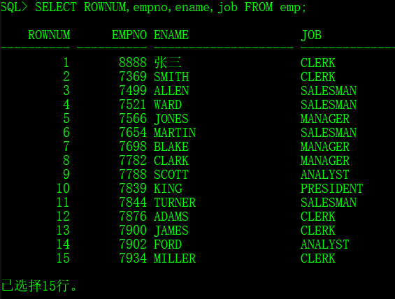

ROWNUM的编号是动态生成的，不是固定的。

```sql
SELECT ROWNUM,empno,ename,job FROM emp WHERE deptno=10;
```


> 取出第一行数据

```sql
SELECT * FROM emp WHERE ROWNUM=1;
```

> 取出前n行数据

```sql
SELECT * FROM emp WHERE ROWNUM<=5;
```

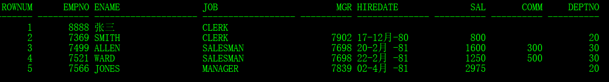

> 取出第n~m行数据

```SQL
SELECT *
FROM
	(SELECT ROWNUM rn,emp.* FROM emp)
WHERE rn BETWEEN 6 AND 10 ;
```

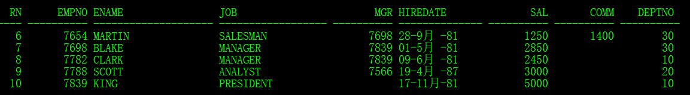

## 15.2 ROWID (了解)

ROWID：数据行存储的物理地址编号

> 观察ROWID的存在

```sql
SELECT ROWID,deptno,dname,loc FROM dept;
```


> 利用ROWID找到记录

```sql
SELECT * FROM dept WHERE ROWID='AAAR3qAAEAAAACHAAA';
```

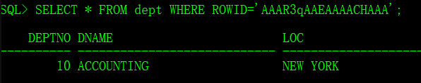

> 删除重复记录

1、将dept表数据复制到mydept表中

```sql
CREATE TABLE mydept AS SELECT * FROM dept;
```

2、添加重复数据

```sql
INSERT INTO mydept(deptno,dname,loc) VALUES(10,'ACCOUNTING','NEW YORK');
INSERT INTO mydept(deptno,dname,loc) VALUES(10,'ACCOUNTING','NEW YORK');
INSERT INTO mydept(deptno,dname,loc) VALUES(10,'ACCOUNTING','NEW YORK');
INSERT INTO mydept(deptno,dname,loc) VALUES(30,'SALES','CHICAGO');
INSERT INTO mydept(deptno,dname,loc) VALUES(30,'SALES','CHICAGO');
```

3、删除重复数据

```sql
DELETE FROM mydept WHERE ROWID NOT IN(
	SELECT MIN(ROWID)
    FROM mydept
    GROUP BY deptno,dname,loc);
```

# 16 表的创建与管理

## 16.1 常见的数据类型

<table>
    <tr>
    	<th>No.</th>
        <th>类型</th>
        <th>作用</th>
    </tr>
    <tr>
        <td>1</td>
        <td>VARCHAR2(n)</td>
        <td>表示字符串，其中n表示最大的长度，一般保存长度较小的内容都可以使用此类型。例如：姓名、地址、邮政编码、电话(200个字以内的内容都建议使用VARCHAR2表示)</td>
    </tr>
    <tr>
        <td rowspan="2">2</td>
        <td rowspan="2">NUMBER(n,m)</td>
        <td>NUMBER(n)：表示整数数据，最多不能超过n个长度，可以使用INT代替</td>
    </tr>
    <tr>
        <td>NUMBER(n,m)：表示小数位占m位，而整数位占n-m位，使用FLOAT代替</td>
    </tr>
    <tr>
        <td>3</td>
        <td>DATE</td>
        <td>保存日期时间数据</td>
    </tr>
    <tr>
        <td>4</td>
        <td>CLOB</td>
        <td>二进制数据，最多可以保存4G的文字，可以保存《红楼梦》</td>
    </tr>
    <tr>
        <td>5</td>
        <td>BLOB</td>
        <td>二进制数据，最多可以保存4G的内容，可以保存文字、图片、音乐、电影</td>
    </tr>
</table>

## 16.2 创建数据表

创建数据表的语法格式：

> CREATE TABLE 表名称(
>
> ​	列名称	类型	[DEFAULT 默认值],
>
> ​	列名称	类型	[DEFAULT 默认值],
>
> ​	列名称	类型	[DEFAULT 默认值],...
>
> ​	列名称	类型	[DEFAULT 默认值]
>
> );

> 创建一张成员信息表

```sql
CREATE TABLE member(
	mid NUMBER,
    name VARCHAR2(50) DEFAULT '无名氏',
    age NUMBER(3),
    birthday DATE DEFAULT SYSDATE,
    note CLOB
);
```

> 向表中增加数据

```sql
INSERT INTO member(mid,name,age,birthday,note)
VALUES(10,'张三',30,TO_DATE('1985-11-11','yyyy-mm-dd'),'帅哥。');
--没有添加完成会设置默认数据
INSERT INTO member(mid,age,note)
VALUES(11,33,'美女。');
```

## 16.3 数据表的重命名（了解）

每一张数据表针对于oracle而言是属于它的一个对象，所有的数据库对象必须由Oracle统一管理。

在Oracle数据库里面为了能够记录下所有对象的信息，提供了数据字典的概念，在数据里面一共提供了三个级别的数据字典：

- 用户级别：user_*开头，指的是一个用户可以使用的数据字典；
- 管理员级别：dba_*开头，指的是由数据库管理员使用的数据字典；
- 全部级别：all_*开头，表示不管是用户还是管理员都可以使用。

```sql
SELECT * FROM user_tables;
```

显示数据库表对象的全部信息内容，包括名称、存储情况等。

**表重命名**

> RENAME 旧的表名称 TO 新的表名称；

> 将member表更名为person

```sql
RENAME member TO person;
```

## 16.4 截断表（了解）

如果说想清空一张数据表的记录，第一反应就是执行DELETE操作，但是在使用DELETE的时候，表所占用的资源（约束、索引）并不会被立刻释放掉。

如果想将数据表所占用的全部资源都清空，那么就需要使用截断表的操作。

```sql
TRUNCATE TABLE 表名称;
```

## 16.5 复制表（了解）

复制表的语法：

> CREATE TABLE 表名称 AS 子查询；

> 创建一张只包含有10部门雇员信息的数据包

```sql
CREATE TABLE emp10 AS SELECT * FROM emp WHERE deptno=10;
```

> 创建一张只包含有20部门雇员编号、姓名、工资的数据表

```sql
CREATE TABLE emp20 AS SELECT empno,ename,sal FROM emp WHERE deptno=20;
```

> 复制emp的表结构但是不复制里面的数据

```sql
CREATE TABLE empnull AS
SELECT * FROM emp WHERE 1=2;
```

## 16.6 表的删除（重点）

删除表（结构和数据）的语法：

> DROP TABLE 表名称；

表删除后会进入回收站中！

## 16.7 闪回技术（理解）

> 查看回收站中的内容

```sql
COL original_name FOR A30;
COL object_name FOR A30;
COL droptime FOR A30;
SELECT original_name,object_name,droptime FROM user_recyclebin;
```


> 通过回收站恢复一张被删除的表

```sql
FLASHBACK TABLE mydept TO BEFORE DROP;
```

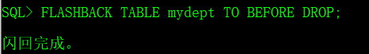

> 强制删除数据表

``` sql
DROP TABLE mydept PURGE;
```

> 清空回收站

```sql
PURGE RECYCLEBIN;
```

## 16.7 修改表结构（了解，强烈不建议使用）

先创建一个数据库脚本

```sql
--删除数据表
DROP TABLE member PURGE;
--创建数据表
CREATE TABLE member(
	mid NUMBER,
   	name VARCHAR2(50)
);
--测试数据
INSERT INTO member(mid,name) VALUES(10,'张三');
INSERT INTO member(mid,name) VALUES(20,'李四');
--事务提交
COMMIT;
```

向数据表中增加两列。

```sql
ALTER TABLE member ADD(email VARCHAR2(20));
ALTER TABLE member ADD(sex VARCHAR2(5) DEFAULT '男');
```

修改表中的数据列。

```sql
ALTER TABLE member MODIFY(name VARCHAR2(20) DEFAULT '无名');
```

删除列

```sql
ALTER TABLE member DROP COLUMN email;
```

