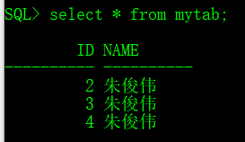
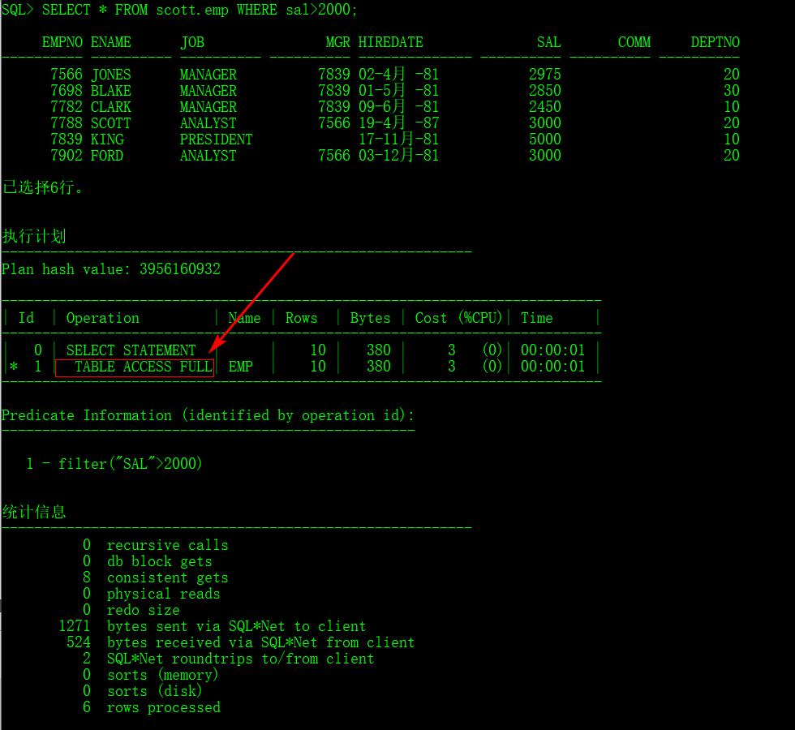
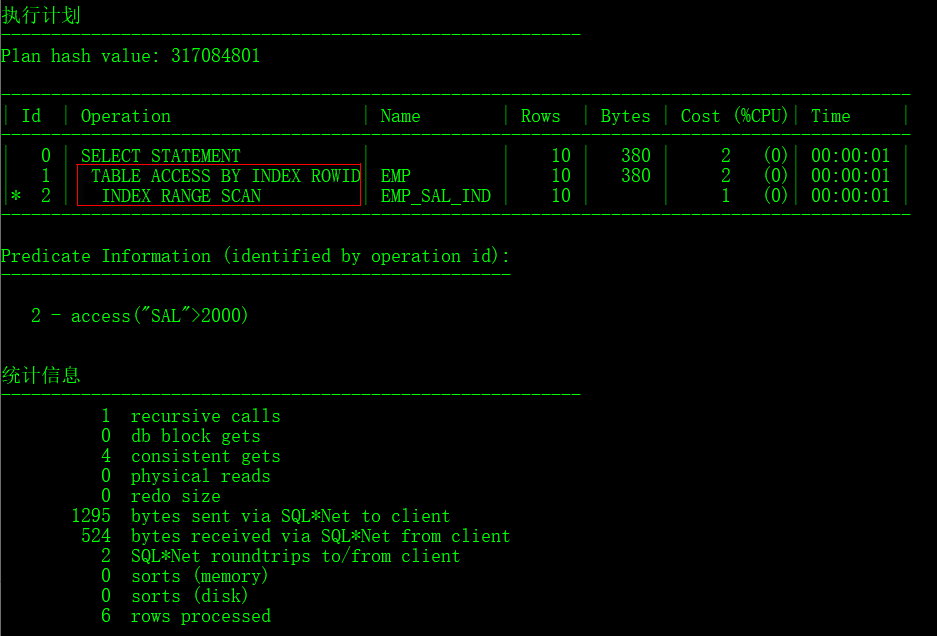

[TOC]

# 17 约束的创建于管理

约束是保证数据表完整性的一种手段，在SQL语法之中约束一共分为六种（数据类型、非空约束、唯一约束、主键约束、检查约束、外键约束）

## 17.1 非空约束

（NOT NULL，NK）

**数据表中的某一列数据不允许为null**

> 定义数据表，使用非空约束

```sql
DROP TABLE member PURGE;
CREATE TABLE member(
	mid NUMBER,
    name VARCHAR2(20) NOT NULL
);
```

## 17.2 唯一约束

（UNIQUE，UK）

**数据表中某一列的内容不允许重复。**

```sql
DROP TABLE member PURGE;
CREATE TABLE member(
	mid NUMBER,
    name VARCHAR2(20) NOT NULL,
    email VARCHAR2(30) UNIQUE
);
```

> 设置约束名称

```sql
DROP TABLE member PURGE;
CREATE TABLE member(
	mid NUMBER,
    name VARCHAR2(20) NOT NULL,
    email VARCHAR2(30) ,
    CONSTRAINT uk_email UNIQUE(email)
);
```

## 17.3 主键约束 

（PRIMARY KEY，PK）

**主键约束 =  唯一约束+非空约束**

```sql
DROP TABLE member PURGE;
CREATE TABLE member(
	mid NUMBER,
    name VARCHAR2(20) NOT NULL,
    CONSTRAINT pk_mid PRIMARY KEY(mid)
);
```

## 17.4 检查约束

（CHECK，CK）

在数据更新操作前设置过滤条件，检查是否符合。如设置年龄的范围，设置性别只能为男、女

> 设置检查约束

```SQL
DROP TABLE member PURGE;
CREATE TABLE member(
	mid NUMBER,
    name VARCHAR2(20) ,
    age NUMBER(3) ,
    sex VARCHAR2(5),
    CONSTRAINT ck_age CHECK(age BETWEEN 0 AND 250),
    CONSTRAINT ck_sex CHECK(sex IN ('男','女'))
);
```

## 17.5 外键约束

（FOREIGN KEY , FK）

**要设置的字段值必须在其他字段或其他表中的字段存在**

```sql
DROP TABLE member PURGE;
DROP TABLE book PURGE;
CREATE TABLE member(
	mid NUMBER,
    name VARCHAR2(20) ,
    CONSTRAINT pk_mid PRIMARY KEY(mid)
);
CREATE TABLE book(
	bid NUMBER,
    title VARCHAR2(20) ,
    mid NUMBER,
    CONSTRAINT pk_bid PRIMARY KEY(bid),
    CONSTRAINT fk_mid FOREIGN KEY(mid) REFERENCES member(mid)
);
```

**外键会带来很多限制**

- 限制一：如果表中存在外键，在删除父表前一定要先删除子表

```sql
DROP TABLE book PURGE;
DROP TABLE member PURGE;
```

如果A表中有B的外键，B中有A的外键，只能强制删除

```sql
DROP TABLE member CASCADE CONSTRAINT;
```

- 限制二：父表中作为子表关联的外键字段，必须设置为主键约束或是唯一约束

- 限制三：默认情况下，如果父表记录中有对应的子表记录，那么父表记录无法被删除

> 数据的级联删除(ON DELETE CASCADE)

```sql
CREATE TABLE book(
	bid NUMBER,
    title VARCHAR2(20) ,
    mid NUMBER,
    CONSTRAINT pk_bid PRIMARY KEY(bid),
    CONSTRAINT fk_mid FOREIGN KEY(mid) REFERENCES member(mid) ON DELETE CASCADE
);
```

> 级联更新（ON DELETE SET NULL）

```sql
CREATE TABLE book(
	bid NUMBER,
    title VARCHAR2(20) ,
    mid NUMBER,
    CONSTRAINT pk_bid PRIMARY KEY(bid),
    CONSTRAINT fk_mid FOREIGN KEY(mid) REFERENCES member(mid) ON DELETE SET NULL
);
```

## 17.6 约束修改（了解）

一般是提前建立好约束的~~

> 假设有数据表

```sql
DROP TABLE member PURGE;
CREATE TABLE member(
	mid NUMBER,
    name VARCHAR2(20)
);
```

增加约束语法

```sql
ALTER TABLE 表名称 ADD CONSTRAINT 约束名称 约束类型(字段)[选项];
```

>为表中增加约束

```sql
ALTER TABLE member MODIFY(name VARCHAR2(20) NOT NULL);
```

为表删除约束语法

```sql
ALTER TABLE 表名称 DROP CONSTRAINT 约束名称;
```

> 删除约束

```sql
ALTER TABLE member DROP CONSTRAINT pk_mid;
```

# 18 序列

只有Oracle 12C版本之后才提供自动增长列，在此之前只能手工处理。

创建序列语法：

```sql
CREATE SEQUENCE 序列名称
[INCREMENT BY 步长][START WITH 开始值]
[MAXVALUE 最大值 | NOMAXVALUE]
[MINVALUE 最小值| NOMINVALUE]
[CYCLE | NOCYCLE]
[CHCHE 缓存数据 | NOCHCHE]
```

> 创建序列

```sql
CREATE SEQUENCE myseq;
```

> 使用序列

```sql
DROP TABLE mytab;
CREATE TABLE mytab(
	id NUMBER,
    name VARCHAR2(20),
    CONSTRAINT pk_id PRIMARY KEY(id)
);
--使用序列
INSERT INTO mytab(id,name) VALUES(myseq.nextval,'朱俊伟');
```



# 19 视图

视图：查询的结果，和表类似，但不是表。

创建语法：

```sql
CREATE [OR REPLACE] VIEW 试图名称 AS 子查询;
```

从Oracle 10g R2 开始，默认情况下SCOTT用户不具备创建视图的权限

> 为SCOTT用户授予创建视图的权限

```sql
CONN sys/change_on_install AS SYSDBA;
GRANT CREATE VIEW TO scott;
CONN scott/tiger;
```

为视图创建约束（[WITH CHECK OPTION](https://www.cnblogs.com/gynbk/p/6556137.html)），此时视图修改的话要满足约束条件（视图创建时的条件）

```sql
CREATE OR REPLACE VIEW myview
AS
SELECT * FROM emp WHERE deptno=20
WITH CHECK OPTION;
```

如果要修改此视图的话，其deptno=20才行


创建只读视图（WITH READ ONLY）

```sql
CREATE OR REPLACE VIEW myview
AS
SELECT * FROM emp WHERE deptno=20
WITH READ ONLY;
```

删除视图

```sql
DROP VIEW myview;
```

# 20 索引

为了方便观察先切换到sys用户，观察跟踪器的信息。（scott用户不能查看到）

```sql
CONN sys/change_on_install AS SYSDBA;
--打开跟踪器
SET AUTOTRACE ON;
```

> 查询一下

```sql
SELECT * FROM scott.emp WHERE sal>2000;
```



可以看到数据查询的时候是采用**全局扫描**的方式。

> 在sal字段上建立索引

```sql
CREATE INDEX emp_sal_ind ON scott.emp(sal);
SELECT * FROM scott.emp WHERE sal>2000;
```



**建立索引后不是扫描数据表，而是扫描索引数据（B*Tree）**

如果数据量较大，索引需要被改变时，需要消耗大量的内存空间，降低数据库性能。

**怎么提高数据的检索速度同时保证数据统计的需要？**

# 21 用户管理

如果想要实现用户的管理操作，那么必须要提供有管理员权限，使用sys用户操作；

```sql
CONN sys/change_on_install AS SYSDBA;
```

> 创建一个新的用户：dog/wangwang

```sql
CREATE USER dog IDENTIFIED BY wangwang;
```

> 为dog用户分配“CREATE SESSION”的权限

```sql
GRANT CREATE SESSION TO dog;
```

> 为dog用户分配创建表的权限

```sql
GRANT CREATE TABLE TO dog;
--创建表
CREATE TABLE mytab(
	id NUMBER
);
```

> 为dog用户分配角色

```sql
GRANT CONNECT,RESOURCE TO dog;
```

> 修改一个用户的密码

```sql
ALTER USER dog IDENTIFIED BY miaomiao;
```

> 让密码登录后失效

```sql
ALTER USER dog PASSWORD EXPIRE;
```

> 锁定dog用户

```sql
ALTER USER dog ACCOUNT LOCK;
```

> 解锁dog用户

```sql
ALTER USER dog ACCOUNT UNLOCK;
```

此时dog用户如果想要访问scott用户下的资源根本不能访问。

> 将scott用户的操作对象权限授予其他用户

对象的权限只有四种：INSERT、UPDATE、SELECT、DELETE

```sql
GRANT SELECT,INSERT ON scott.emp TO dog;
```

> 收回dog的权限

```sql
REVOKE CONNECT,RESOURCE FROM dog;
REVOKE CREATE SESSION,CREATE TABLE FROM dog;
```

> 删除dog用户

```SQL
DROP USER dog CASCADE;
```

