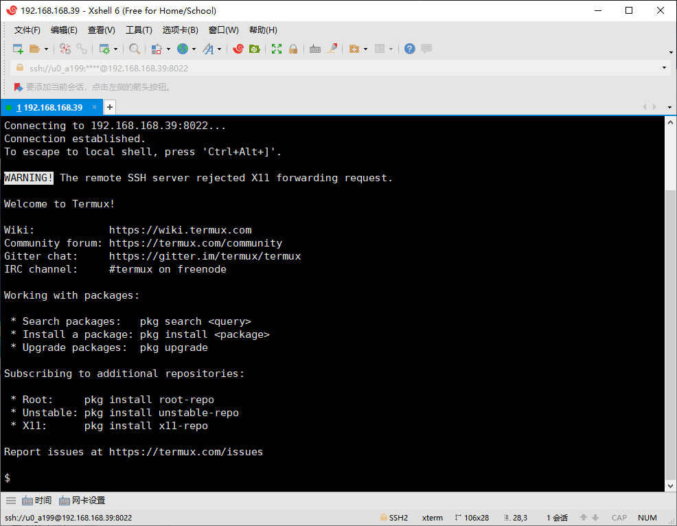

[TOC]

# 1 切换镜像

参考 : https://mirrors.tuna.tsinghua.edu.cn/help/termux/

## 图形界面（TUI）替换
在较新版的 Termux 中，官方提供了图形界面（TUI）来半自动替换镜像，推荐使用该种方式以规避其他风险。 在 Termux 中执行如下命令
```shell
termux-change-repo
```
在图形界面引导下，使用自带方向键可上下移动。
第一步使用空格选择需要更换的仓库，之后在第二步选择 TUNA/BFSU 镜像源。确认无误后回车，镜像源会自动完成更换。

## 命令行替换
```shell
sed -i 's@^\(deb.*stable main\)$@#\1\ndeb https://mirrors.tuna.tsinghua.edu.cn/termux/apt/termux-main stable main@' $PREFIX/etc/apt/sources.list
apt update && apt upgrade
```

## 手动修改
编辑 $PREFIX/etc/apt/sources.list 修改为如下内容
```shell
# The termux repository mirror from TUNA:
deb https://mirrors.tuna.tsinghua.edu.cn/termux/apt/termux-main stable main
```
请使用内置或安装在 Termux 里的文本编辑器，例如 `vi` / `vim` / `nano` 等，不要使用 RE 管理器等其他具有 ROOT 权限的外部 APP 来修改 Termux 的文件

## 安装常用软件

```shell
pkg install vim openssh curl wget ls tree root-repo x11-repo -y
```

## 起别名
编辑~/.alias文件
```shell
alias vi='vim'
alias ll='ls -l'
```

编辑~/.bashrc文件

```shell
if [ -f ~/.alias ]; then
	. ~/.alias
fi

echo "用户:"$(whoami)
if pgrep -x "sshd" >/dev/null
then
	echo "sshd运行中..."
else
	sshd
	echo "启动sshd"
fi
```

重新加载.bashrc文件

```
source ~/.bashrc
```


# 2、通过电脑连接手机termux

一、电脑端操作

1、cmd生成公钥、私钥

> ssh-keygen -t rsa

在`C:\Users\用户名\.ssh\`有生成的公钥`id_rsa.pub`、私钥`id_rsa`

2、把id_rsa.pub公钥文件传输到你的手机根目录下。

二、手机端操作

1、在termux上安装openssh，输入`pkg install openssh`。

2、为了Termux能读出我们手机上的根目录下，需要执行`termux-setup-storage`命令。现在我们的根目录就被映射到了~/storage/shared。

3、然后我们通过cat命令把根目录的公钥文件内容写到authorized_keys文件里，执行如下命令，`cat ~/storage/shared/id_rsa.pub >> ~/.ssh/authorized_keys`。

4、上面三部操作完之后现在可以启动手机上ssh服务了，执行`sshd`命令。

5、接下来查看手机的ip地址，输入`ifconfig`，可以看到你手机的ip地址形如192.168.1.2，记下来。

6、再查看Termux用户名，输入`whoami`，能看到形如u0_a82，就是你的用户名，记下来。

三、继续回到电脑上操作：

1、通过xshell或其他ssh工具连接到刚才的ip地址，选择我们刚才生成的私钥。端口默认为8022，密码不用输入。




