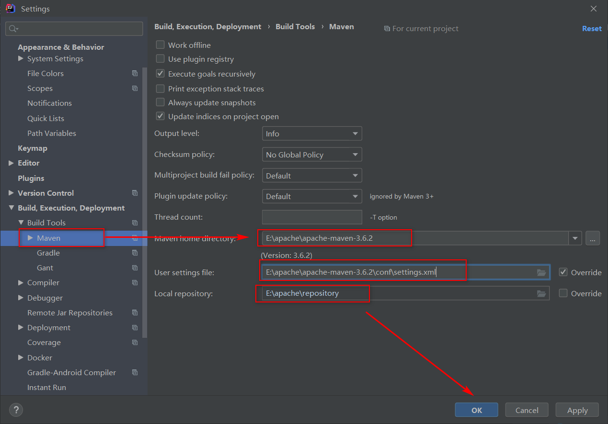
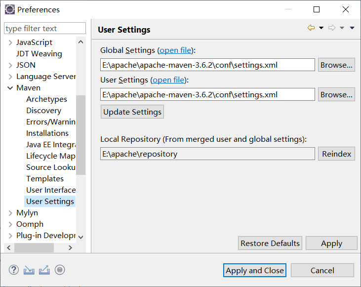

# 1、下载

maven官方 https://maven.apache.org/download.cgi

清华镜像下载maven https://mirrors.tuna.tsinghua.edu.cn/apache/maven/maven-3/

# 2、解压


# 3、配置maven所在路径


在命令行使用命令`mvn -v`查看maven路径是否配置正确


# 4、配置本地仓库位置、镜像位置

打开..\apache-maven-3.6.2\conf\setting.xml

## 4.1 仓库位置(本地仓库)

设置本地仓库的位置


## 4.2 镜像位置(远程仓库)

这里配置阿里云的仓库


```xml
<mirror>
    <id>alimaven</id>
    <name>aliyun maven</name>
    <url>http://maven.aliyun.com/nexus/content/groups/public/</url>
    <mirrorOf>central</mirrorOf>       
</mirror>
```

# 5、IDEA配置maven



# 6、Eclipse配置maven



