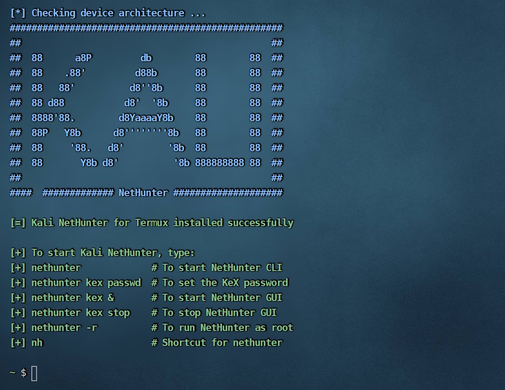
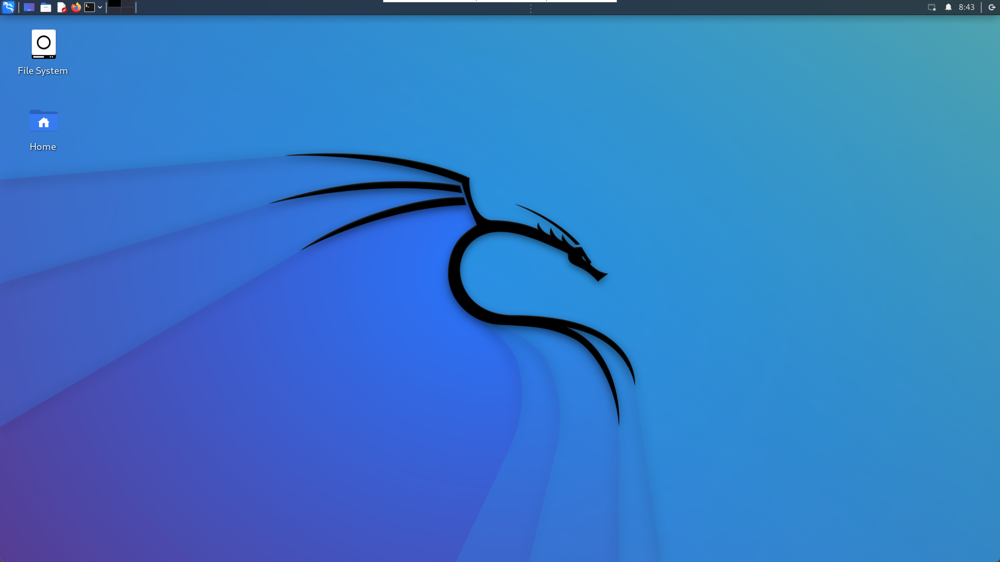

[TOC]

# 1 切换镜像

参考 : https://mirrors.tuna.tsinghua.edu.cn/help/termux/

## 图形界面（TUI）替换

在较新版的 Termux 中，官方提供了图形界面（TUI）来半自动替换镜像，推荐使用该种方式以规避其他风险。 在 Termux 中执行如下命令

```shell
termux-change-repo
```

在图形界面引导下，使用自带方向键可上下移动。
第一步使用空格选择需要更换的仓库，之后在第二步选择 TUNA/BFSU 镜像源。确认无误后回车，镜像源会自动完成更换。

## 命令行替换

```shell
sed -i 's@^\(deb.*stable main\)$@#\1\ndeb https://mirrors.tuna.tsinghua.edu.cn/termux/apt/termux-main stable main@' $PREFIX/etc/apt/sources.list
apt update && apt upgrade
```

## 手动修改

编辑 $PREFIX/etc/apt/sources.list 修改为如下内容

```shell
# The termux repository mirror from TUNA:
deb https://mirrors.tuna.tsinghua.edu.cn/termux/apt/termux-main stable main
```

请使用内置或安装在 Termux 里的文本编辑器，例如 `vi` / `vim` / `nano` 等，不要使用 RE 管理器等其他具有 ROOT 权限的外部 APP 来修改 Termux 的文件

## 安装常用软件

```shell
pkg install vim openssh curl wget sl tree nmap root-repo openjdk-17 x11-repo -y
```

## 起别名

编辑~/.alias文件

```shell
alias vi='vim'
alias ll='ls -l'
alias grep='grep --color=auto'
alias ifconfig='ifconfig 2>/dev/null'
```

编辑~/.bashrc文件

```shell
if [ -f ~/.alias ]; then
	. ~/.alias
fi
# 设置语系

LANG=zh_CN.UTF-8
LANGUAGE=zh_CN.UTF-8
echo "欢迎: "$(whoami)
echo "时间:" `date "+%Y-%m-%d %H:%M"`
echo -e "IP  :\e[33m" `ifconfig|grep 'inet'|cut -d ' ' -f 10|grep -v '127.0.0.1'` "\e[0m"
if pgrep -x "sshd" >/dev/null
then
	:
else
	sshd
fi
curl zh.wttr.in/上海?format=3
```

重新加载.bashrc文件

```
source ~/.bashrc
```

# 2、通过电脑连接手机termux

## 方式1

通过passwd命令设置用户的密码

## 方式2

一、电脑端操作

1、cmd生成公钥、私钥

> ssh-keygen -t rsa

在 `C:\Users\用户名\.ssh\`有生成的公钥 `id_rsa.pub`、私钥 `id_rsa`

2、把id_rsa.pub公钥文件传输到你的手机根目录下。

二、手机端操作

1、在termux上安装openssh，输入 `pkg install openssh`。

2、为了Termux能读出我们手机上的根目录下，需要执行 `termux-setup-storage`命令。现在我们的根目录就被映射到了~/storage/shared。

3、然后我们通过cat命令把根目录的公钥文件内容写到authorized_keys文件里，执行如下命令，`cat ~/storage/shared/id_rsa.pub >> ~/.ssh/authorized_keys`。

4、上面三部操作完之后现在可以启动手机上ssh服务了，执行 `sshd`命令。

5、接下来查看手机的ip地址，输入 `ifconfig`，可以看到你手机的ip地址形如192.168.1.2，记下来。

6、再查看Termux用户名，输入 `whoami`，能看到形如u0_a82，就是你的用户名，记下来。

三、继续回到电脑上操作：

1、通过xshell或其他ssh工具连接到刚才的ip地址，选择我们刚才生成的私钥。端口默认为8022，密码不用输入。


# 安装nethunter

> Kali NetHunter is a free & Open-source Mobile Penetration Testing Platform for Android devices, based on Kali Linux.
>
> KaliNetHunter是一个基于KaliLinux的Android设备的免费开源移动渗透测试平台.

## 准备安装脚本和系统

- 脚本

```shell
# 下载，因为网路问题，可能下载不成
wget -O install-nethunter-termux https://offs.ec/2MceZWr
# 下载完成后修改权限
chmod 755 install-nethunter-termux
```

- 系统

```shell
wget https://kali.download/nethunter-images/current/rootfs/kalifs-amd64-full.tar.xz
```

**脚本和系统必须放到家目录下**

## 安装系统

```shell
# 运行install-nethunter-termux启动安装
./install-nethunter-termux

# 中间有两次选择，都选n

# 这里要等一会儿才成功
[*] Extracting rootfs..
```



## nethunter访问

- nh           #直接命令行进入cli
- nh kex &     #后台启动GUI
- nh kex stop  #停止GUI

使用vnc工具进入桌面

- 手机
  下载NetHunter KeX,端口设置为5901
- 电脑
  下载VNC Viewer

> 电脑可能无法访问nh的5901端口，通过rinetd工具进行端口转发

```shell
# 安装rinetd
pkg install rinetd
# 配置
vim $PREFIX/etc/rinetd.conf
# 添加下面设置
0.0.0.0    5900    127.0.0.1    5901
#启动rinetd
rinetd
```

## nethunter启停脚本

### nh_start.sh

```shell
# nh=nethunter
rinetd
nh kex &
```

### nh_stop.sh

```shell
# nh=nethunter
pkill rinetd
nh kex stop
```

## nethunter界面



# 备份与恢复

## 备份
1. 确保有存储权限
```shell
termux-setup-storage
```

2. 备份文件
```shell
tar -zcf /sdcard/termux-backup.tar.gz -C /data/data/com.termux/files ./home ./usr
```

## 恢复
1. 确保有存储权限
```shell
termux-setup-storage
```

2. 恢复备份文件
```shell
tar -zxf /sdcard/termux-backup.tar.gz -C /data/data/com.termux/files --recursive-unlink --preserve-permissions
```
> 恢复后重启应用即可


## 使用系统工具备份与恢复
最新版本的有`termux-backup`和`termux-restore`命令提供备份与恢复操作，可参考官方文档。
参考：https://wiki.termux.com/wiki/Backing_up_Termux

```shell
# 备份
termux-backup /sdcard/backup.tar.xz
# 恢复
termux-restore /sdcard/backup.tar.xz
```


备份在重新安装termux时非常之有用！后悔之前不会备份~